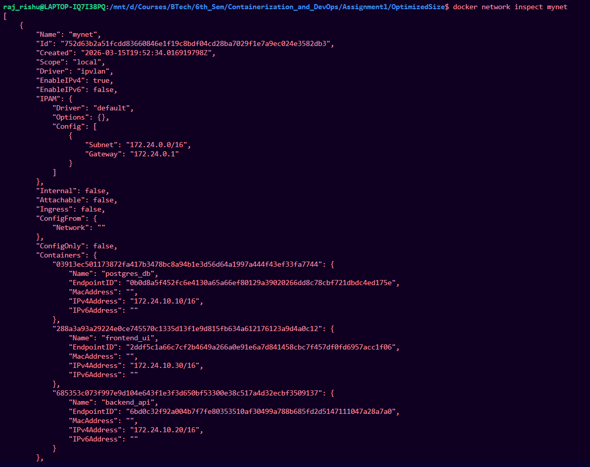
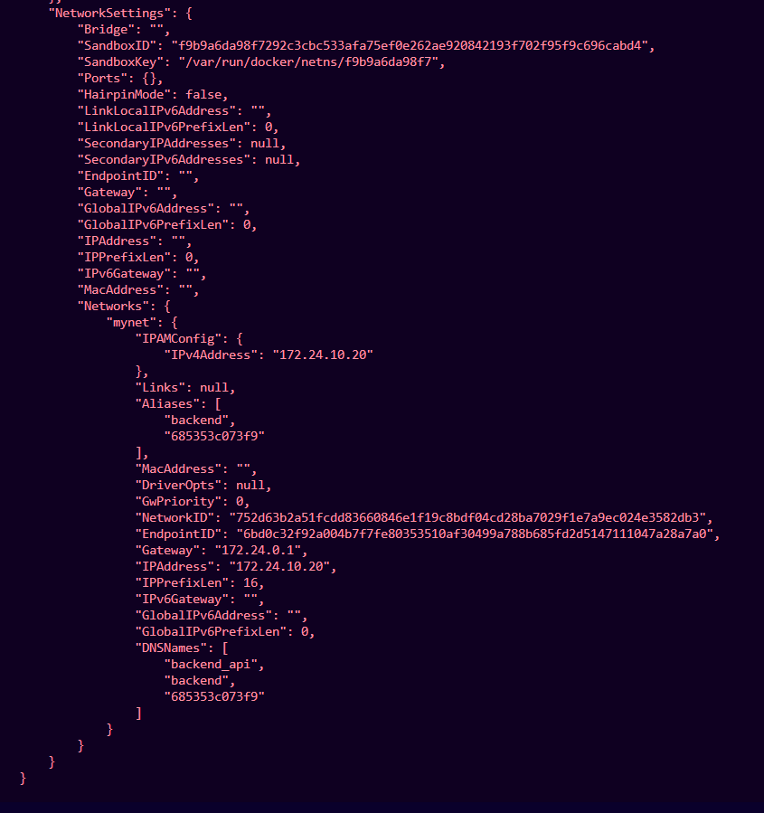
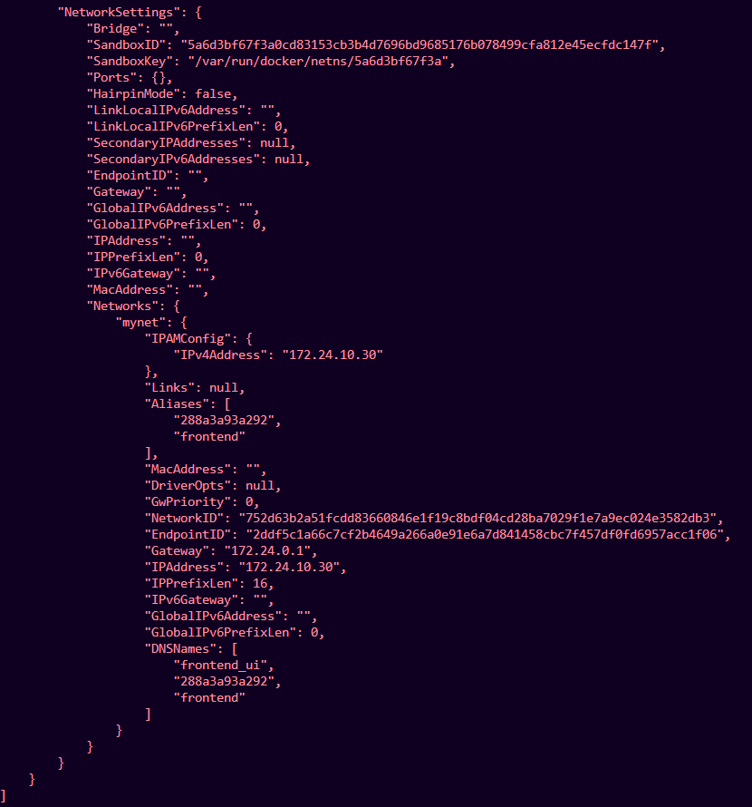
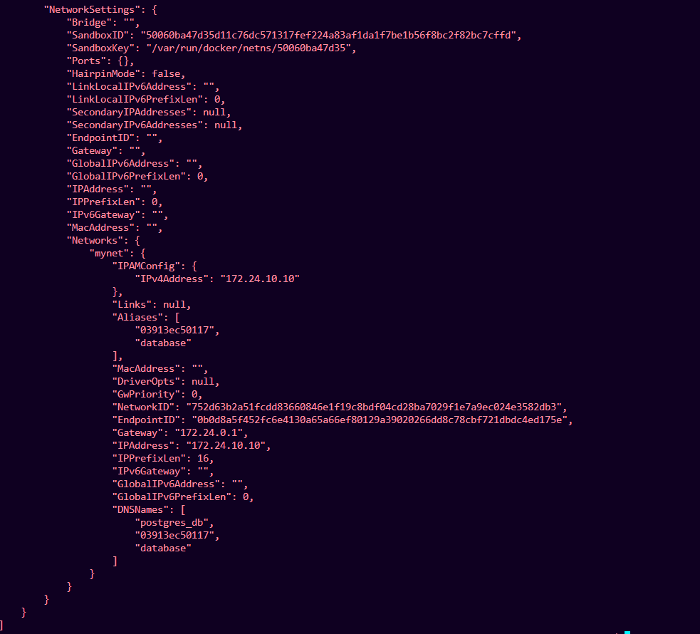
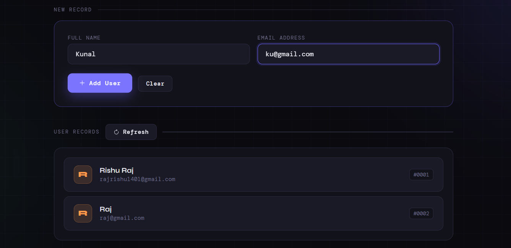
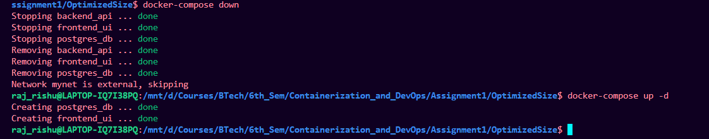
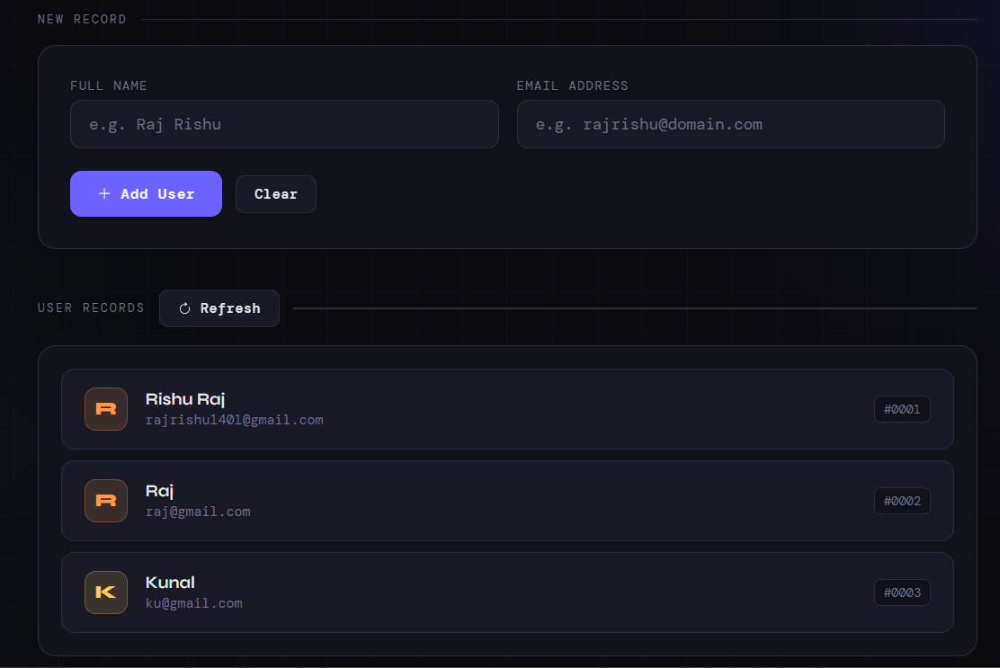
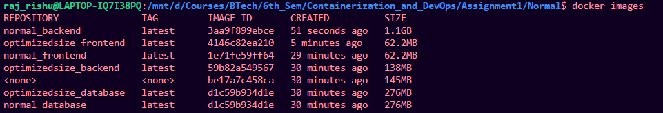

# Project Deliverables

## 1. GitHub Repository

The complete project source code is available in the GitHub repository.

Repository includes:

* Backend source code
* Database configuration
* Frontend UI
* Dockerfiles
* Docker Compose configuration
* Documentation

🔗 **GitHub Repository:**  
[Containerized Web Application Project](https://github.com/rajrishu1401/ContainerizationAndDevOPsLab/tree/main/Assignment/Assignment1)

---

# 2. Separate Dockerfiles

The project contains separate Dockerfiles for each service.

### Backend Dockerfile

Location:

```
backend/Dockerfile
```

Responsible for building the Node.js backend API.

Features:

* Multi-stage build
* Alpine base image
* Non-root user
* Minimal runtime environment

---

### Database Dockerfile

Location:

```
database/Dockerfile
```

Responsible for building the PostgreSQL container with initialization scripts.

Environment variables configured:

```
POSTGRES_DB
POSTGRES_USER
POSTGRES_PASSWORD
```

---

# 3. docker-compose.yml

Docker Compose orchestrates all services.

Services defined:

* frontend
* backend
* database

Compose configuration includes:

* static IP assignment
* external IPVLAN network
* named volumes
* environment variables
* restart policy


```yaml
version: "3.9"

services:

  database:
    build: ./database
    container_name: postgres_db
    restart: always
    volumes:
      - postgres_data:/var/lib/postgresql/data
    networks:
      mynet:
        ipv4_address: 172.24.10.10

  backend:
    build: ./backend
    container_name: backend_api
    restart: always
    depends_on:
      - database
    environment:
      DB_HOST: 172.24.10.10
      DB_USER: appuser
      DB_PASSWORD: securepassword
      DB_NAME: appdb
    networks:
      mynet:
        ipv4_address: 172.24.10.20

  frontend:
    build: ./frontend
    container_name: frontend_ui
    restart: always
    networks:
      mynet:
        ipv4_address: 172.24.10.30

volumes:
  postgres_data:

networks:
  mynet:
    external: true
```

---

# 4. Network Creation Command

The IPVLAN network is created manually using the following command:

```bash
docker network create -d ipvlan \
--subnet=172.24.0.0/16 \
--gateway=172.24.0.1 \
-o parent=eth0 \
mynet
```

---

# 5. Screenshot Proofs

The following screenshots are included as proof of correct configuration.

### docker network inspect

Command used:

```
docker network inspect mynet
```



Shows:

* network configuration
* connected containers
* assigned IP addresses

---

### Container IPs

Command used:

```
docker inspect backend_api
```


```
docker inspect frontend_ui
```



```
docker inspect postgres_db
```



Shows static IP assignment for containers.

---

### Volume Persistence Test

Add content to the database:




Commands used:

```
docker compose down
docker compose up -d
```





Previously inserted data remains available after container restart.

---

# 6. Short Report (3–5 Pages)

The report contains the following sections.

---

## Build Optimization Explanation

The backend container uses a **multi-stage Docker build with an Alpine Linux base image** to reduce the final image size and improve security. Multi-stage builds separate the **build environment** from the **runtime environment**, ensuring that only the necessary application files and dependencies are included in the final container image.

### Backend Multi-Stage Dockerfile

```dockerfile
FROM node:20-alpine AS builder

WORKDIR /app
COPY package.json .
RUN npm install --production
COPY server.js .

FROM node:20-alpine

WORKDIR /app
COPY --from=builder /app /app

RUN addgroup -S appgroup && adduser -S appuser -G appgroup
USER appuser

EXPOSE 5000
CMD ["node", "server.js"]
```

### Optimization Techniques Used

* **Alpine base images** provide a lightweight Linux environment.
* **Multi-stage builds** ensure that only runtime files are included in the final image.
* **Non-root user execution** improves container security.
* **Minimal layers** reduce overall image size.

These optimizations help produce a **smaller, more secure, and efficient container image** compared to traditional single-stage Docker builds.


---

## Network Design Diagram

Architecture:

```
Client
  │
  ▼
Frontend Container
  │
  ▼
Backend Container
  │
  ▼
PostgreSQL Container
```

All services communicate through a custom IPVLAN network.

---

## Image Size Comparison

Docker images were compared between optimized and non-optimized builds.

Create one stack with Alpine and multi-stage dockerfile named as opimizedsize_backend and other with no Alpine and single-stage named as normal_backend.

```
docker images
```




We can see that opimizedsize_backend has less size than normal_backend.

Results show that Alpine-based images significantly reduce container size.

---

## macvlan vs ipvlan Comparison

| Feature            | Macvlan                     | Ipvlan                   |
| ------------------ | --------------------------- | ------------------------ |
| MAC Address        | Unique                      | Shared                   |
| Host communication | No                          | Yes                      |
| Network isolation  | High                        | Moderate                 |
| Use case           | Physical network simulation | Virtualized environments |

IPVLAN was chosen due to compatibility with WSL2 networking.
