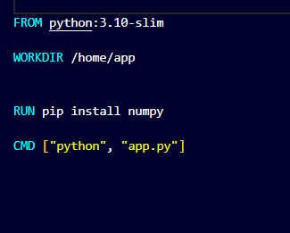
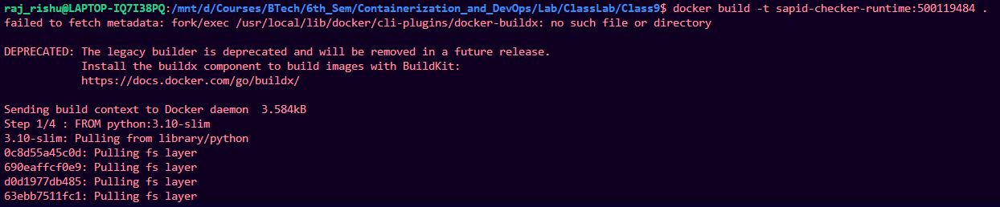
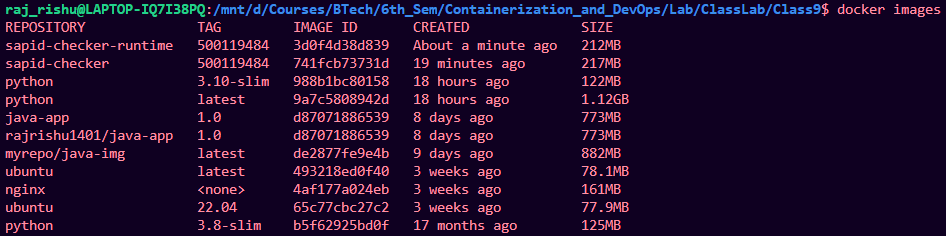
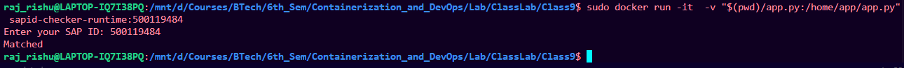

# Making python app image but app attached at run time of image

## Create docker file

1. create separate folder
2. create a python program:


3. create docker file with commands:

```bash
FROM python:3.8-slim

WORKDIR /home/app

RUN pip install numpy

CMD [ "python","app.py" ]

```



---

## Build and run image

1. Build the image from the docker file

```bash
docker build -t sapid-checker-runtime:500119484 .
```




2. Check Image:

```bash
docker images
```



3. Run the image while attaching the app.py:

```bash
sudo docker run -it -v "$(pwd)/app.py:/home/app/app.py" sapid-checker-runtime:500119484
```

## Result

Python program running



