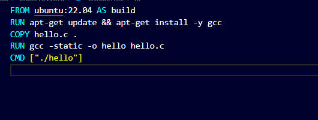
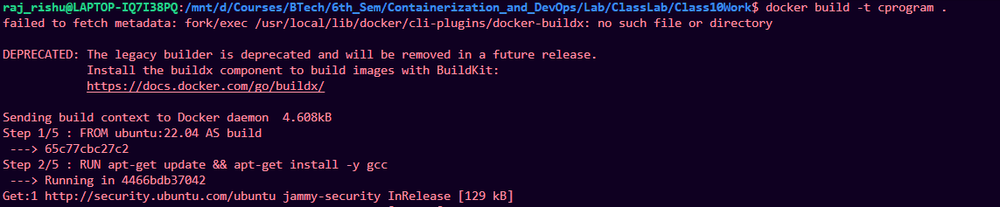
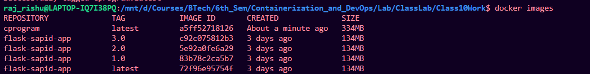
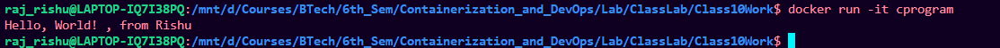

# Making C program image

## Create docker file

1. create separate folder
2. create a C program:


3. create docker file with commands:

```bash

FROM ubuntu:22.04 AS build
RUN apt-get update \&\& apt-get install -y gcc
COPY hello.c .
RUN gcc -static -o hello hello.c
CMD ["./hello"]

```



---

## Build and run image

1. Build the image from the docker file

```bash
docker build -t cprogram .
```




2. Check Image:

```bash
docker images
```



3. Run the image:

```bash
docker run -it cprogram
```

## Result

C program running



