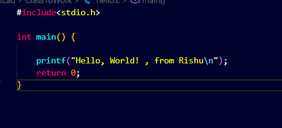
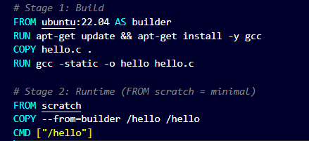
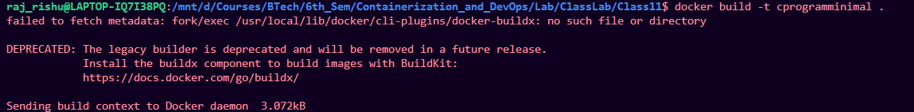
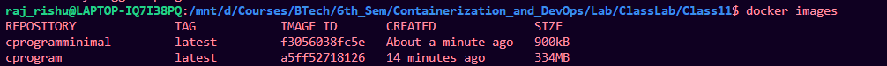
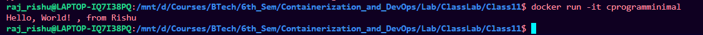

# Making C program multistage image 

## Create docker file

1. create separate folder
2. create a C program:



3. create docker file with commands:

```bash

# Stage 1: Build
FROM ubuntu:22.04 AS builder
RUN apt-get update && apt-get install -y gcc
COPY hello.c .
RUN gcc -static -o hello hello.c

# Stage 2: Runtime (FROM scratch = minimal)
FROM scratch
COPY --from=builder /hello /hello
CMD ["/hello"]


```



---

## Build and run image

1. Build the image from the docker file

```bash
docker build -t cprogramminimal .
```




2. Check Image:

### Result: size of this multistage is less than sigle stage c program image

```bash
docker images
```



3. Run the image:

```bash
docker run -it cprogram
```

C program running




