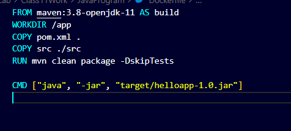
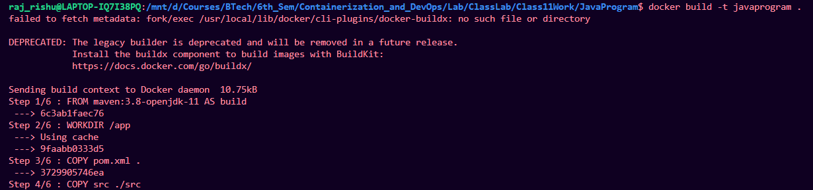
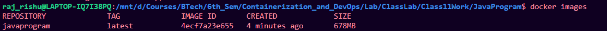
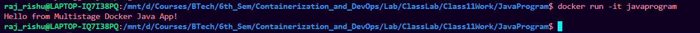

# Making Java program image

## Create docker file

1. create separate folder
2. create a python program:


3. create docker file with commands:

```bash

FROM maven:3.8-openjdk-11 AS build
WORKDIR /app
COPY pom.xml .
COPY src ./src
RUN mvn clean package -DskipTests

CMD ["java", "-jar", "target/helloapp-1.0.jar"]


```



---

## Build and run image

1. Build the image from the docker file

```bash
docker build -t javaprogram .
```




2. Check Image:

```bash
docker images
```



3. Run the image:
e

```bash
docker run -it javaprogram
```

## Result

Java program running



