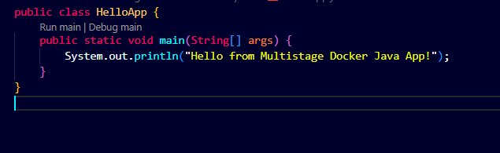
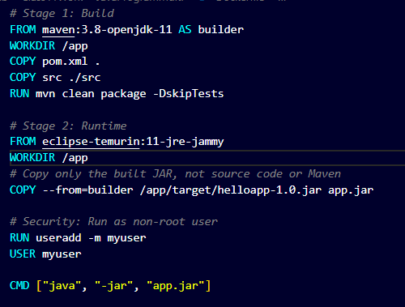
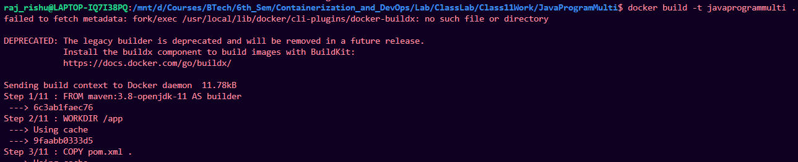
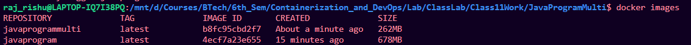
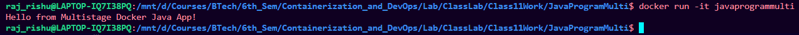

# Making Java program multistage image 

## Create docker file

1. create separate folder
2. create a Java program:



3. create docker file with commands:

```bash

# Stage 1: Build
FROM maven:3.8-openjdk-11 AS builder
WORKDIR /app
COPY pom.xml .
COPY src ./src
RUN mvn clean package -DskipTests

# Stage 2: Runtime
FROM eclipse-temurin:11-jre-jammy
WORKDIR /app
# Copy only the built JAR, not source code or Maven
COPY --from=builder /app/target/helloapp-1.0.jar app.jar

# Security: Run as non-root user
RUN useradd -m myuser
USER myuser

CMD ["java", "-jar", "app.jar"]


```



---

## Build and run image

1. Build the image from the docker file

```bash
docker build -t javaprogrammulti .
```




2. Check Image:


### Result: size of this multistage is less than sigle stage java program image

```bash
docker images
```



3. Run the image:

```bash
docker run -it javaprogrammulti
```

## Result

Java program running



