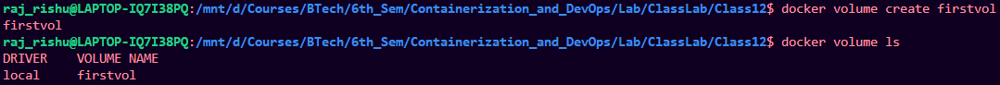
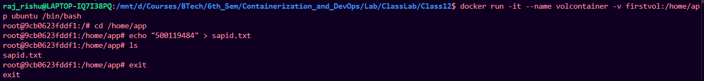
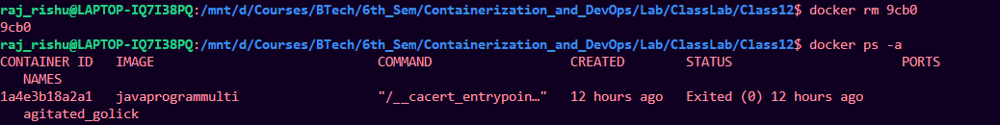
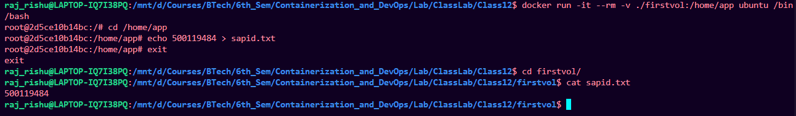

# Working with Volumes

## Creating volume:

Run the folloing commannd:

```bash
docker volume create firstvol
```



---

## Run a container attaching the volume

```bash
docker run -it --name volcontainer -v firstvol:/home/app ubuntu /bin/bash
```
add a text file to the volume




## Remove the container:

```bash
docker rm 9cb0
docker ps -a
```




## Run different container with the same volume attached:

```bash
docker run -it --name volcontainer2 -v firstvol:/home/app ubuntu /bin/bash

```
check for the created text file from previous container


# Making local file through containers

```bash
docker run -it --rm -v ./firstvol:/home/app ubuntu /bin/bash

```

make a file and the check it on local directory


