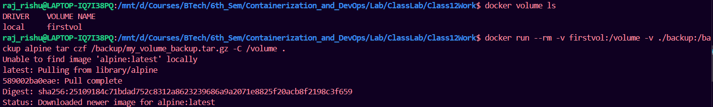
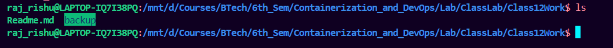
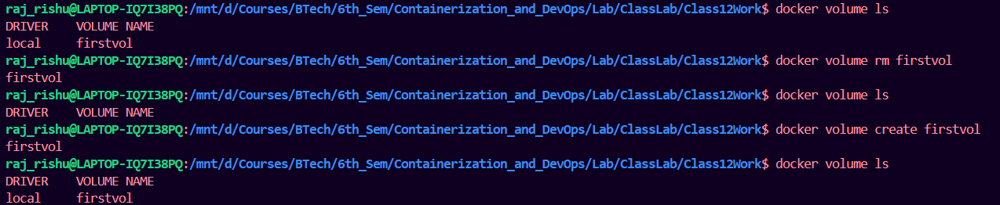
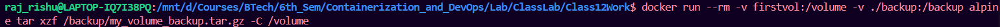
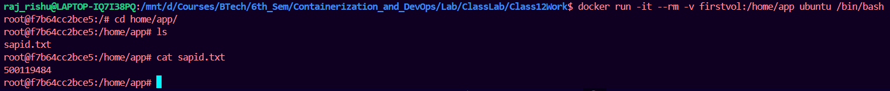

# Making a backup of a volume

## make the backup

Run the folloing commannd for baking up the a Volume named firstvol:

```bash
docker run --rm -v firstvol:/volume -v ./backup:/backup alpine tar czf /backup/my_volume_backup.tar.gz -C /volume . 
```



result: Backup added



---

## remove volume and create another empty volume

```bash
docker volume rm firstvol
docker volume create firstvol
```




## Restore the backup volume into the new volume:

```bash
docker run --rm -v firstvol:/volume -v ./backup:/backup alpine tar xzf /backup/my_volume_backup.tar.gz -C /volume
```




## Check if the backup is restored:

Run different container with the created volume

```bash
docker run -it --rm -v firstvol:/home/app ubuntu /bin/bash
```

check for the files of deleted volume




