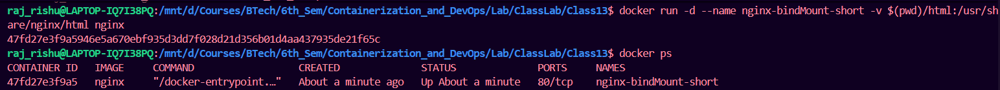
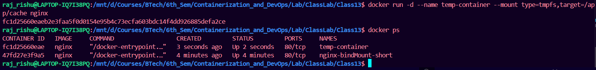

## Task 1: Create Bind Mount

### Using `-v`

```bash
docker run -d \
  --name nginx-container \
  -v /home/prateek/html:/usr/share/nginx/html \
  nginx
```

### Using `--mount`

```bash
docker run -d \
  --name nginx-container \
  --mount type=bind,source=/home/prateek/html,target=/usr/share/nginx/html \
  nginx
```



Now:

* Editing files on host
* Changes reflect immediately inside container

---

## Task 2: Remove Bind Mount

Bind mount is removed when container is removed:

```bash
docker rm -f nginx-container
```

No separate "delete" like volume.

---

## Bind Mount Use Case

### Use Case 1: Development Environment

Example:

* Node.js app
* Source code on host
* Container runs app

Benefits:

* Live code updates
* No rebuild required
* Fast development

---

# 3. tmpfs Mount

## Concept

tmpfs stores data in **RAM only**.

* No persistence
* Deleted when container stops
* Very fast

---

## Task: Create tmpfs Mount

```bash
docker run -d \
  --name temp-container \
  --mount type=tmpfs,target=/app/cache \
  nginx
```

Or:

```bash
docker run -d \
  --tmpfs /app/cache \
  nginx
```


---