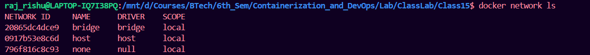
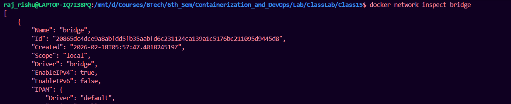
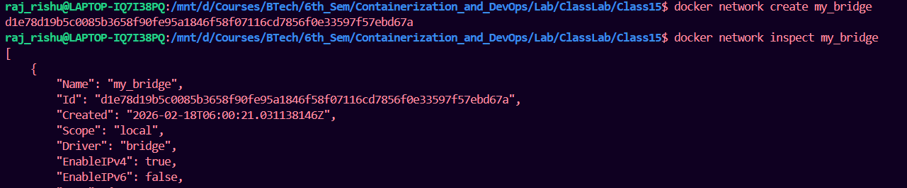
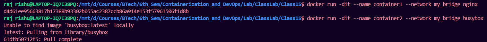
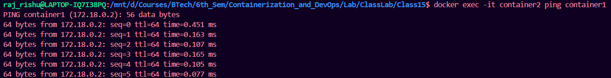
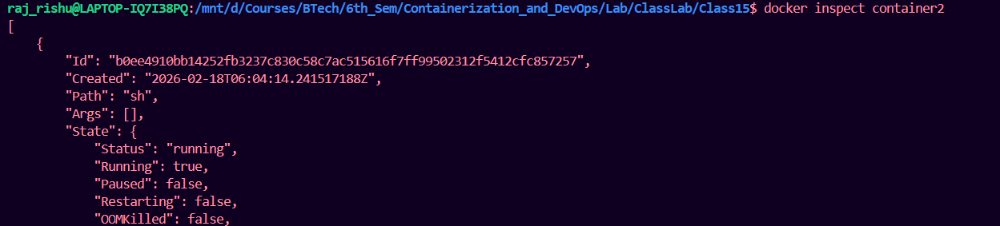
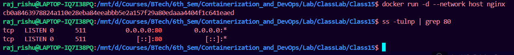
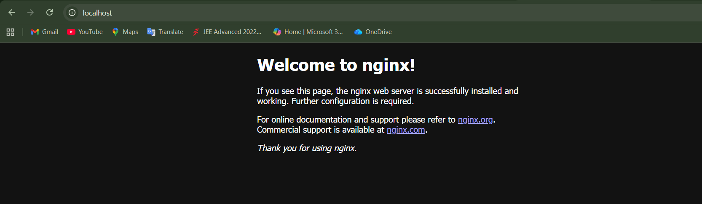

# 1. Networking in Docker – Fundamentals

## Why Docker Networking is Needed

Containers:

* Run in isolated environments
* Have their own network namespace
* Need to communicate:

  * Container ↔ Container
  * Container ↔ Host
  * Container ↔ External world
  * Cross-host (multi-node cluster)

Docker provides a pluggable networking model via **network drivers**.

---

## Core Concepts

### 1. Network Namespace

Each container gets:

* Own IP
* Own routing table
* Own network interfaces
* Own port space

### 2. Virtual Ethernet (veth pair)

Docker connects containers using:

* One side inside container
* One side attached to bridge on host

### 3. Docker Embedded DNS

* Automatic container name resolution
* Works inside user-defined bridge/overlay networks

---

# 2. Docker Network Drivers

Docker supports multiple network drivers:

| Driver  | Scope                    | Isolation      | Multi-host | Performance | Complexity  |
| ------- | ------------------------ | -------------- | ---------- | ----------- | ----------- |
| bridge  | Single host              | Medium         | No         | Good        | Simple      |
| host    | Single host              | None           | No         | Excellent   | Very Simple |
| overlay | Multi-host               | Strong         | Yes        | Moderate    | Complex     |
| macvlan | Single host (can extend) | High           | Limited    | High        | Medium      |
| ipvlan  | Single host              | High           | Limited    | High        | Medium      |
| none    | Single host              | Full isolation | No         | N/A         | Simple      |

---

# 3. Bridge Network (Default Driver)

## What is Bridge Network?

* Default driver
* Creates virtual bridge `docker0`
* Containers get private IP (172.x.x.x)
* NAT used for external communication

---

## Types

1. Default bridge (`docker0`)
2. User-defined bridge (recommended)

---

## Requirements

* Single host
* No cross-host communication
* Internal microservices
* Development environment

---

## Hands-on Tasks

### Task 1: Inspect Default Bridge

```bash
docker network ls
docker network inspect bridge
```





---

### Task 2: Create Custom Bridge

```bash
docker network create my_bridge
docker network inspect my_bridge
```




---

### Task 3: Run Containers in Same Network

```bash
docker run -dit --name container1 --network my_bridge nginx
docker run -dit --name container2 --network my_bridge busybox
```



---

### Task 4: Check the connection from one container to another

```bash
docker exec -it container2 ping container1
```



---

### Task 5: Inspect Containers

```bash
docker inspect container2
```




# 4. Host Network

## Run nginx on host port

```bash
docker run -d --network host nginx
ss -tulnp \| grep 80
```



Result:

