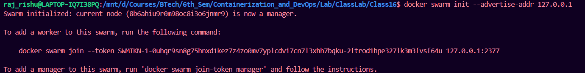
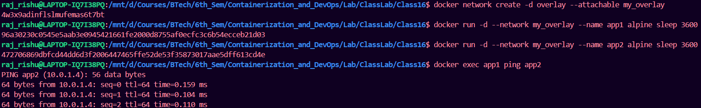
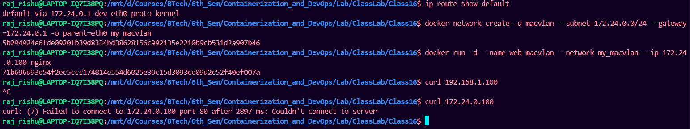
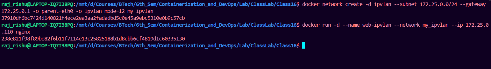

## 1. Overlay Networks (Multi-Host)

### What is Overlay?

When you have multiple servers (hosts) running Docker, containers need to talk across hosts. Overlay networks create a virtual network that spans all hosts.

**Analogy:** Imagine tunnels connecting buildings – containers in different buildings can talk as if they're next door.

### Prerequisites for Overlay

1. **Docker Swarm mode enabled** (Docker's clustering solution)
2. **Ports open** between hosts:
   - 2377/tcp: Swarm management
   - 7946/tcp/udp: Node communication
   - 4789/udp: Overlay network traffic

### Important Note for Beginners

**If you're on a laptop/college WiFi:**
- Overlay networks for **multi-host** likely won't work (WiFi blocks the ports)
- But you can still **learn** by running everything on one machine!

### Single-Machine Overlay Lab (Learning Purpose)

```bash
# Step 1: Initialize Swarm (on one machine)
# --advertise-addr tells Swarm "I'm at this IP"
# Use 127.0.0.1 for learning (only works locally!)
docker swarm init --advertise-addr 127.0.0.1

# Step 2: Create overlay network
# --attachable allows regular containers to use it
docker network create -d overlay --attachable my_overlay

# Step 3: Run containers (they'll all be on same machine)
docker run -d --network my_overlay --name app1 alpine sleep 3600
docker run -d --network my_overlay --name app2 alpine sleep 3600

# Step 4: Test communication
docker exec app1 ping app2  # Works!
```

### Why This Works (Even on One Machine)
- Overlay is designed for multiple hosts
- But Docker can run it on one host for testing
- Real multi-host requires open ports and proper networking





---

## 2. MACVLAN Network

### What is MACVLAN?

Each container gets:
- A real MAC address (like a physical network card)
- A real IP from your physical network
- Appears as a separate device on your LAN

**Analogy:** Instead of apartments sharing a mailbox (NAT), each container has its own house with its own mailbox.

### When to Use MACVLAN

* **Good for:**
- Legacy apps that expect direct network access
- Network monitoring tools
- Apps that don't work well with NAT
- When you need containers to have real LAN IPs

**Not good for:**
- Laptops on WiFi (usually doesn't work)
- When host needs to talk to container (complex)
- Networks that limit MAC addresses per port

### MACVLAN Lab (If Your Network Allows)

```bash
# Step 1: Find your network details
# On Linux:
ip route show default
# Shows: default via 172.24.0.1 dev eth0
# Interface: eth0, Gateway: 172.24.0.1

# Step 2: Create MACVLAN network
# -o parent=eth0 : Use your actual network interface
docker network create -d macvlan \
  --subnet=172.24.0.0/24 \
  --gateway=172.24.0.1 \
  -o parent=eth0 \
  my_macvlan

# Step 3: Run container with specific IP
docker run -d \
  --name web-macvlan \
  --network my_macvlan \
  --ip 172.24.0.100 \
  nginx

# Step 4: Test from ANOTHER computer on same network
# Open browser to http://172.24.1.100
# Should see nginx!

# Step 5: Important - Host cannot reach container!
# This won't work (expected behavior)
curl 172.24.0.100  # From host, may fail
```



**Why host can't reach container:** The host's physical interface and the MACVLAN interface are separate – they don't talk to each other directly.

---

## 3. IPVLAN Network

### What is IPVLAN?

Similar to MACVLAN but containers share the host's MAC address while having different IPs.

**Analogy:** Apartment building with one main door (shared MAC) but different apartment numbers (IPs).

### IPVLAN vs MACVLAN

| Feature | MACVLAN | IPVLAN |
|--------|---------|--------|
| MAC addresses | One per container | One shared for all |
| Network switch load | Higher (learns many MACs) | Lower (one MAC) |
| Scalability | Limited by switch | Much higher |
| Best for | Small deployments | Large-scale |

### IPVLAN Lab

```bash
# Create IPVLAN network
docker network create -d ipvlan \
  --subnet=172.25.0.0/24 \
  --gateway=172.25.0.1 \
  -o parent=eth0 \
  -o ipvlan_mode=l2 \
  my_ipvlan

# Run container
docker run -d \
  --name web-ipvlan \
  --network my_ipvlan \
  --ip 172.25.0.110 \
  nginx
```



---

