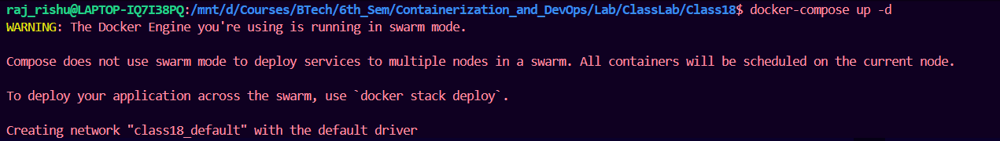
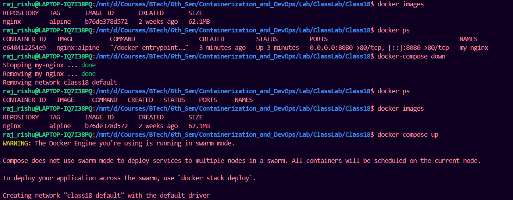
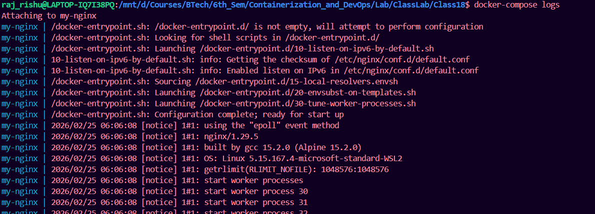
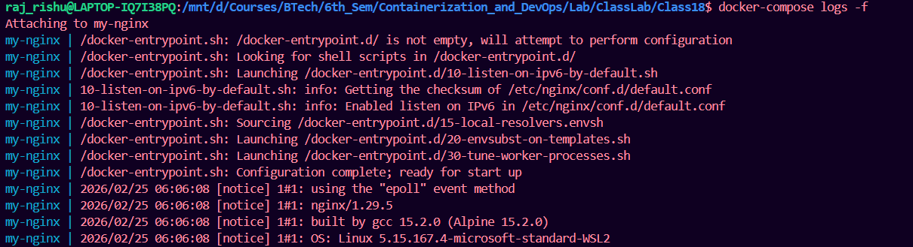

# Docker Compose vs Docker Run: A Direct Comparison

## Understanding the Relationship

**Docker Compose** is essentially a YAML-based wrapper around multiple `docker run` commands. It translates your compose file into individual Docker commands behind the scenes. Let's see how each `docker run` flag maps to Docker Compose.

## Direct Comparison: docker run vs docker-compose.yml

### Example: Running Nginx with Docker Run

```bash
# Single docker run command with various options
docker run \
  --name my-nginx \
  -p 8080:80 \
  -v ./html:/usr/share/nginx/html \
  -e NGINX_HOST=localhost \
  --restart unless-stopped \
  -d \
  nginx:alpine
```
### Same Setup with Docker Compose:

```yaml
# docker-compose.yml - This does the SAME thing as above command
version: '3.8'
services:
  nginx:
    image: nginx:alpine          # Image name (same as in docker run)
    container_name: my-nginx     # --name my-nginx
    ports:
      - "8080:80"               # -p 8080:80
    volumes:
      - ./html:/usr/share/nginx/html  # -v ./html:/usr/share/nginx/html
    environment:
      - NGINX_HOST=localhost    # -e NGINX_HOST=localhost
    restart: unless-stopped     # --restart unless-stopped
    # Note: -d flag in docker run = detached mode
    # In docker-compose, use: docker-compose up -d
```



## Mapping Common Docker Run Flags to Compose

### 1. **Port Mapping**
```bash
# Docker Run
docker run -p 8080:80 -p 3000:3000 nginx
```
```yaml
# Docker Compose
ports:
  - "8080:80"
  - "3000:3000"
```

### 2. **Volume Mounting**
```bash
# Docker Run
docker run -v ./data:/app/data -v myvolume:/app/config nginx
```
```yaml
# Docker Compose
volumes:
  - ./data:/app/data           # Bind mount (host path)
  - myvolume:/app/config       # Named volume
  
# Also define named volumes at the bottom:
volumes:
  myvolume:                    # This creates the named volume
```

### 3. **Environment Variables**
```bash
# Docker Run
docker run -e DB_HOST=localhost -e DB_PORT=5432 app
```
```yaml
# Docker Compose
environment:
  - DB_HOST=localhost
  - DB_PORT=5432

# OR using dictionary format
environment:
  DB_HOST: localhost
  DB_PORT: 5432
```

### 4. **Network Configuration**
```bash
# Docker Run
docker run --network mynetwork --network-alias app1 myapp
```
```yaml
# Docker Compose
networks:
  - mynetwork
  
# With network alias
networks:
  mynetwork:
    aliases:
      - app1

# Define custom network at bottom
networks:
  mynetwork:
    driver: bridge
```

### 5. **Container Name**
```bash
# Docker Run
docker run --name my-container nginx
```
```yaml
# Docker Compose
container_name: my-container
```

### 6. **Restart Policy**
```bash
# Docker Run
docker run --restart unless-stopped nginx
```
```yaml
# Docker Compose
restart: unless-stopped
```

### 7. **Working Directory**
```bash
# Docker Run
docker run -w /app nginx
```
```yaml
# Docker Compose
working_dir: /app
```

### 8. **User/Group**
```bash
# Docker Run
docker run --user 1000:1000 nginx
```
```yaml
# Docker Compose
user: "1000:1000"
```

### 9. **Command Override**
```bash
# Docker Run
docker run nginx echo "Hello"
```
```yaml
# Docker Compose
command: echo "Hello"
```

### 10. **Entrypoint Override**
```bash
# Docker Run
docker run --entrypoint /bin/bash nginx
```
```yaml
# Docker Compose
entrypoint: /bin/bash
```

---

## docker-compose commands






