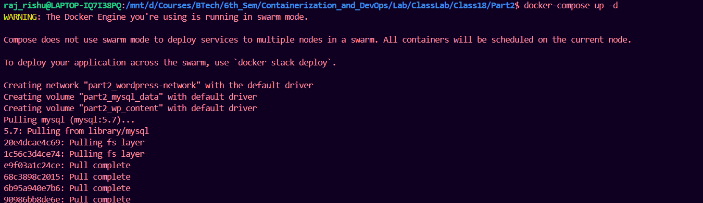
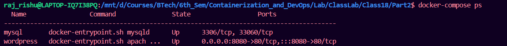
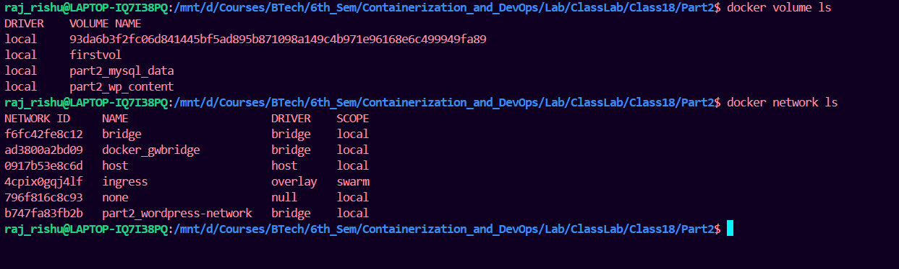

## Multi-Container Example Comparison

### Scenario: WordPress with MySQL

**Using Docker Run (Tedious way):**
```bash
# 1. Create network
docker network create wordpress-network

# 2. Run MySQL
docker run \
  --name mysql \
  --network wordpress-network \
  -e MYSQL_ROOT_PASSWORD=secret \
  -e MYSQL_DATABASE=wordpress \
  -e MYSQL_USER=wpuser \
  -e MYSQL_PASSWORD=wppass \
  -v mysql_data:/var/lib/mysql \
  -d \
  mysql:5.7

# 3. Run WordPress
docker run \
  --name wordpress \
  --network wordpress-network \
  -p 8080:80 \
  -e WORDPRESS_DB_HOST=mysql \
  -e WORDPRESS_DB_USER=wpuser \
  -e WORDPRESS_DB_PASSWORD=wppass \
  -e WORDPRESS_DB_NAME=wordpress \
  -v wp_content:/var/www/html/wp-content \
  -d \
  wordpress:latest
```

**Using Docker Compose (Simple way):**
```yaml
# docker-compose.yml
version: '3.8'

services:
  mysql:
    image: mysql:5.7
    container_name: mysql
    environment:
      MYSQL_ROOT_PASSWORD: secret
      MYSQL_DATABASE: wordpress
      MYSQL_USER: wpuser
      MYSQL_PASSWORD: wppass
    volumes:
      - mysql_data:/var/lib/mysql
    networks:
      - wordpress-network

  wordpress:
    image: wordpress:latest
    container_name: wordpress
    ports:
      - "8080:80"
    environment:
      WORDPRESS_DB_HOST: mysql
      WORDPRESS_DB_USER: wpuser
      WORDPRESS_DB_PASSWORD: wppass
      WORDPRESS_DB_NAME: wordpress
    volumes:
      - wp_content:/var/www/html/wp-content
    depends_on:
      - mysql
    networks:
      - wordpress-network

volumes:
  mysql_data:
  wp_content:

networks:
  wordpress-network:
```

**Run it with one command:**
```bash
docker-compose up -d
```




### Check for the resource created






## What Docker Compose Adds Beyond Docker Run

### 1. **Dependencies & Startup Order**
```yaml
# App waits for database to be ready
depends_on:
  - database
  - redis
```

### 2. **Build Configuration**
```yaml
# Build from Dockerfile instead of using pre-built image
build:
  context: .
  dockerfile: Dockerfile.dev
  args:
    - NODE_ENV=development
```

### 3. **Service Scaling**
```bash
# Run multiple instances
docker-compose up --scale web=3 --scale worker=2
```

### 4. **Unified Configuration**
- Single source of truth
- Version controllable
- Shareable across teams