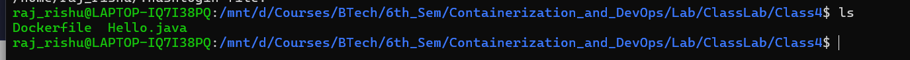
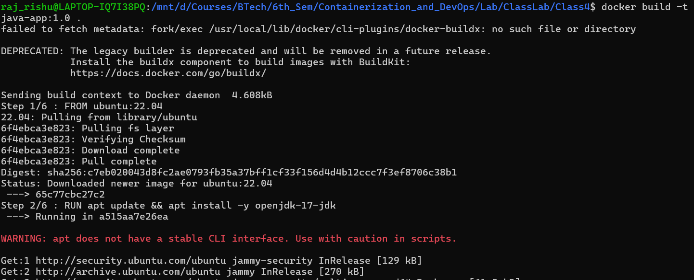
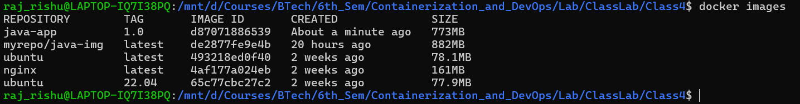

## 4. Hands-On: Build Java App Using Dockerfile

### Step 1: Project Structure (Host Machine)

```text
java-docker/
├── Dockerfile
└── Hello.java
```

---


### Step 2: Java Program (Hello.java)

```java
public class Hello {
    public static void main(String[] args) {
        System.out.println("Hello from Dockerfile automation");
    }
}
```

---


### Step 3: Dockerfile (Automation-Friendly)

```dockerfile
FROM ubuntu:22.04

RUN apt update && apt install -y openjdk-17-jdk

WORKDIR /home/app

COPY Hello.java .

RUN javac Hello.java

CMD ["java", "Hello"]
```

---


## 5. Build Image from Dockerfile

From the project directory:

```bash
docker build -t java-app:1.0 .
```




Explanation:

* `-t` → image name and tag
* `.` → build context (current directory)
* `-f` → specify alternative dockerfile like `test.Dockerfile` 
Verify:

```bash
docker images
```

---

