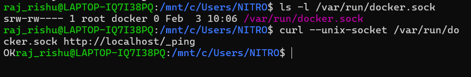
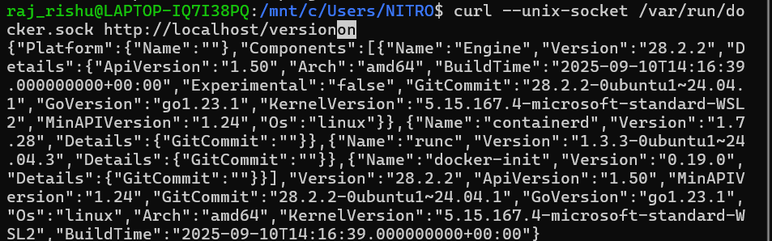
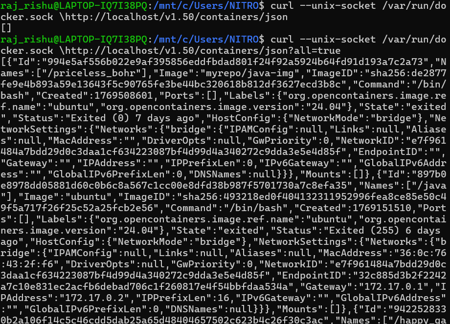

## Docker API

What is the Docker Engine API?

Docker is not magic. The Docker CLI is just a client.

Under the hood:

```bash
docker CLI  →  Docker Engine API  →  containerd / runc
```
1. The Docker Engine API is a Rest API
2. It runs on the Docker Daemon(dockerd)
3. By default is Linux/WSL, it listens on a Unix socket

```bash
/var/run/docker.sock
```

When you run:

```bash
docker ps
```

It actually does something equivalent to:
```bash
GET /containers/json
```

## Verify Docker API Socket in WSL

Inside WSL:

```bash
ls -l /var/run/docker.sock
```

Expected output:

```bash
srw-rw---- 1 root docker 0 docker.sock
```

Check daemon info using API:

```bash
curl --unix-socket /var/run/docker.sock http://localhost/_ping
```

Expected:

```bash
OK
```

If this works, your Docker API is accessible.



---

## API Versioning

Docker API is versioned

```bash
curl --unix-socket /var/run/docker.sock http://localhost/version
```
Sample output:

```json
{
  "Version": "25.0.3",
  "ApiVersion": "1.44"
}
```



We will use:

```bash
/v1.50/
```

---

## List Containers (docker ps)

CLI

```bash
docker ps
```

API

```bash
curl --unix-socket /var/run/docker.sock \
  http://localhost/v1.50/containers/json
```

All containers (including stopped):

```bash
curl --unix-socket /var/run/docker.sock \
  "http://localhost/v1.50/containers/json?all=true"
```



---


