# Introduction to Kubernetes 
> for Local Learning

## 1. Why Kubernetes is Needed

Modern applications are rarely a single program. They usually consist of multiple services such as:

* Backend API
* Frontend
* Database
* Cache
* Message queues
* Monitoring systems

Managing these services manually becomes difficult.

Problems without orchestration:

* Starting services in correct order
* Scaling applications during traffic spikes
* Recovering from crashes
* Networking between containers
* Rolling updates without downtime

Kubernetes solves these problems by acting as a **container orchestration platform**.

It automatically manages:

* Deployment of containers
* Scaling applications
* Self-healing when containers fail
* Service discovery
* Load balancing
* Rolling updates

In short:

> Kubernetes automates deployment, scaling, networking, and management of containerized applications.

---

# 2. Core Kubernetes Components (Conceptual Overview)

A Kubernetes cluster has two major parts.

## A: Control Plane (Master)

Responsible for managing the cluster.

Key components:

**1. API Server**

* Entry point to the cluster
* All commands go through it

**2. Scheduler**

* Decides which node runs a container

**3. Controller Manager**

* Ensures desired state matches actual state

Example:

If you ask for **3 replicas**, it ensures 3 always run.

**4. etcd**

* Key-value database storing cluster state

---

## B: Worker Nodes

These run the actual containers.

Important components:

**1. Kubelet**

* Agent that communicates with control plane

**2. Container Runtime**

Example:

* Docker
* containerd

Responsible for running containers.

**3. Kube Proxy**

Handles networking and service routing.

---

# 3. Why a Real Kubernetes Cluster Is Not Ideal for Learning

A production Kubernetes cluster usually requires:

* Multiple nodes
* Load balancers
* Networking plugins
* Storage systems

Typical production setup:

```
3 control plane nodes
3–10 worker nodes
```

Resource requirements can be large.

Typical minimum:

```
16–32 GB RAM
multiple VMs
complex networking
```

For students or laptops this is not practical.

Therefore we use **local Kubernetes environments**.

---

# 4. Tools for Running Kubernetes Locally

Several tools simulate a Kubernetes cluster locally.

## Minikube

Runs a **single-node Kubernetes cluster**.

Features:

* Beginner friendly
* Works with Docker or VM
* Official learning tool

Limitation:

* Slightly heavy on resources.

---

## k3s

Lightweight Kubernetes distribution.

Features:

* Very small binary
* Reduced memory usage
* Used in edge environments

---

## k3d

Runs **k3s inside Docker containers**.

Advantages:

* Very fast startup
* Easy cluster creation
* Multiple clusters possible

---

## kind (Kubernetes in Docker)

Used mainly for testing.

Features:

* Runs Kubernetes nodes as Docker containers
* Very useful for CI/CD testing

---

# 5. Recommended Stack for Students

For teaching Kubernetes efficiently, the following stack works well.

```
WSL (Linux environment on Windows)

kubectl

k3d

Lens (Kubernetes GUI Optional)
```

---

# Why This Stack Works Well

### WSL

Provides a real Linux environment on Windows.

Benefits:

* Same commands as real servers
* Easy installation
* Lightweight

---

### kubectl

The command line tool used to interact with Kubernetes clusters.

With kubectl you can:

* Create applications
* Inspect resources
* Manage deployments
* Debug clusters

---

### k3d

Provides a local Kubernetes cluster quickly.

Benefits:

* Very fast startup
* Minimal RAM usage
* Runs inside Docker
* Easy to delete and recreate clusters

---

### Lens

Lens is a Kubernetes GUI.

Benefits:

* Visual view of cluster resources
* Pod logs
* Deployment status
* Node monitoring

Useful for beginners to understand cluster structure.

---

# 6. Installation Overview

## Install kubectl

```
curl -LO https://dl.k8s.io/release/stable/bin/linux/amd64/kubectl
chmod +x kubectl
sudo mv kubectl /usr/local/bin/
```


Check installation:

```
kubectl version --client
```
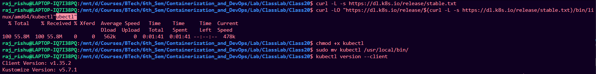

---

## Install k3d

```
curl -s https://raw.githubusercontent.com/k3d-io/k3d/main/install.sh | bash
```
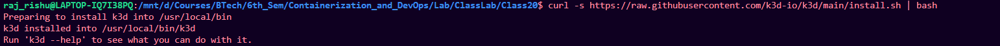

---

## Create Kubernetes Cluster

```
k3d cluster create mycluster
```

Verify:

```
kubectl get nodes
```
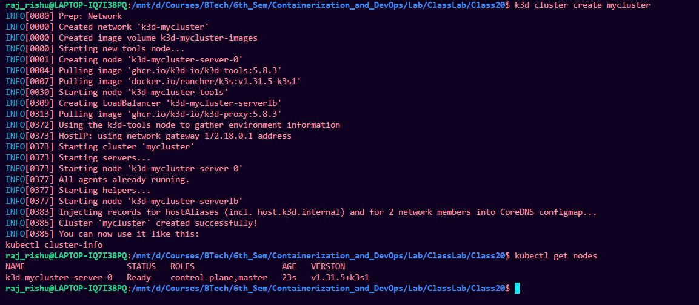

---

# 7. How kubectl Connects to a Kubernetes Cluster

kubectl is only a **client tool**.

It does not contain a cluster itself.

Clusters may exist on:

* Local machine
* Remote server
* Cloud platforms

Examples:

* AWS EKS
* Google GKE
* Azure AKS
* On-premise clusters

kubectl connects to clusters using a configuration file.

Default file location:

```
~/.kube/config
```

This file stores:

* Cluster address
* Authentication credentials
* Context information

> More details in Reference Section
---

## Viewing Available Clusters

```
kubectl config get-contexts
```

Example output:

```
minikube
k3d-mycluster
aws-cluster
```
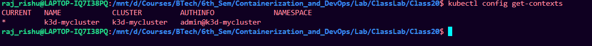

---

## Switching Cluster

```
kubectl config use-context k3d-mycluster
```

This tells kubectl which cluster to interact with.

---

# 8. Common Kubernetes Tasks and kubectl Commands

Below are basic tasks students should learn.

---

# Task 1: View Cluster Nodes

```
kubectl get nodes
```

Purpose:

Shows machines that form the cluster.

Example output:

```
NAME           STATUS   ROLES
k3d-mycluster  Ready    control-plane
```

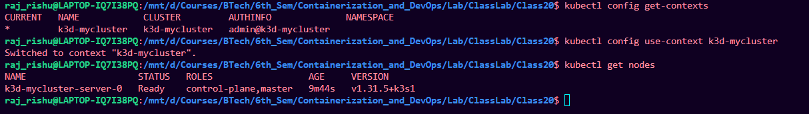

---

# Task 2: View Running Pods

```
kubectl get pods
```

Pods are the smallest deployable units in Kubernetes.

A pod usually contains one container.


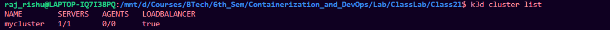


---

# Task 3: Run a Container

```
kubectl run nginx --image=nginx
```

What it does:

Creates a pod running the nginx container.

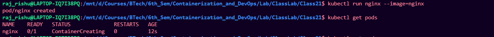

---

# Task 4: View Pod Details

```
kubectl describe pod nginx
```

Shows:

* Events
* container information
* networking
* resource usage

Useful for debugging.

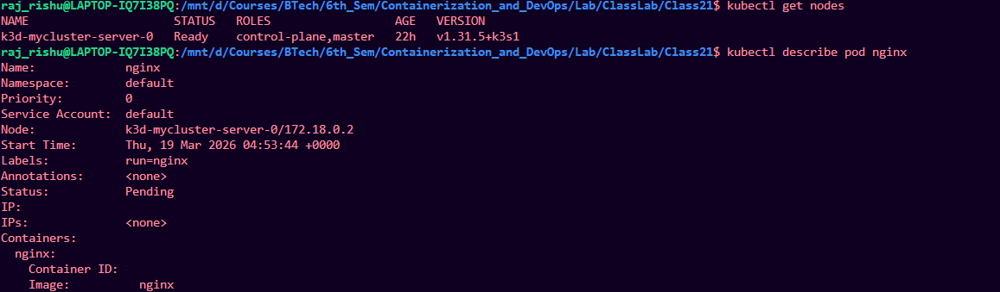

---

# Task 5: View Logs

```
kubectl logs nginx
```

Displays container logs.

---

# Task 6: Create Deployment

```
kubectl create deployment web --image=nginx
```

Deployment manages pods.

Benefits:

* automatic restart
* rolling updates
* scaling

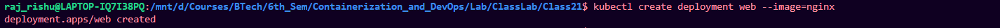

---

# Task 7: Scale Application

```
kubectl scale deployment web --replicas=3
```

Creates multiple pods.

Purpose:

Handle increased traffic.

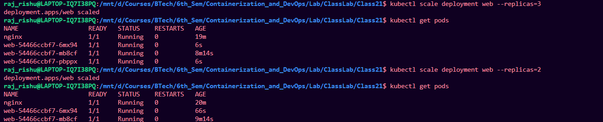

---

# Task 8: Expose Application

```
kubectl expose deployment web --port=80 --type=NodePort
```

Creates a service so the application becomes accessible.

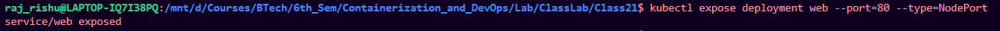

---

# Task 9: List Services

```
kubectl get services
```

Shows how applications are exposed.

### To access using kubectl port-forwarding
```
kubectl port-forward service/web 8080:80
```
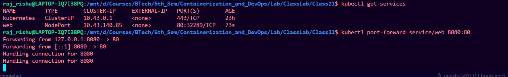

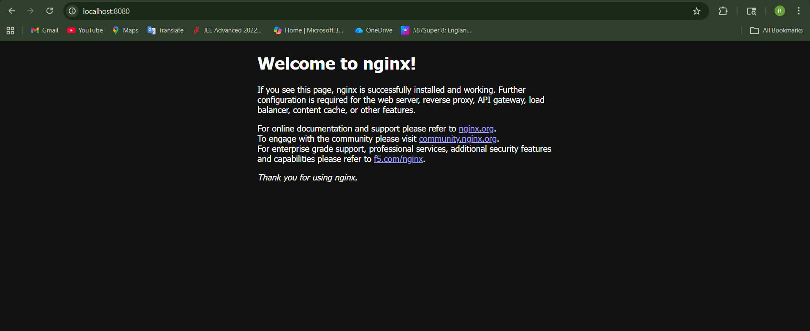

---

# Task 10: Delete Resources

```
kubectl delete pod nginx
```

or

```
kubectl delete deployment web
```

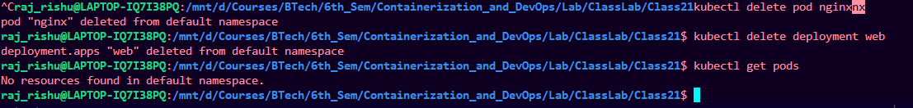