# Hands-on Task: Run and Manage a “Hello Web App” (httpd)

## Objective

Deploy and manage a simple Apache-based web server and:

* verify it is running
* modify it
* scale it
* debug it

> Submit it one GitHub Repo and share its URL

---

# Task: Deploy a Simple Web Application (Apache httpd)

You will run an Apache server instead of nginx.

---

## Step 1: Run a Pod

```bash
kubectl run apache-pod --image=httpd
```

Check:

```bash
kubectl get pods
```


---

## Step 2: Inspect Pod

```bash
kubectl describe pod apache-pod
```

Focus:

* container image = `httpd`
* ports (default 80)
* events

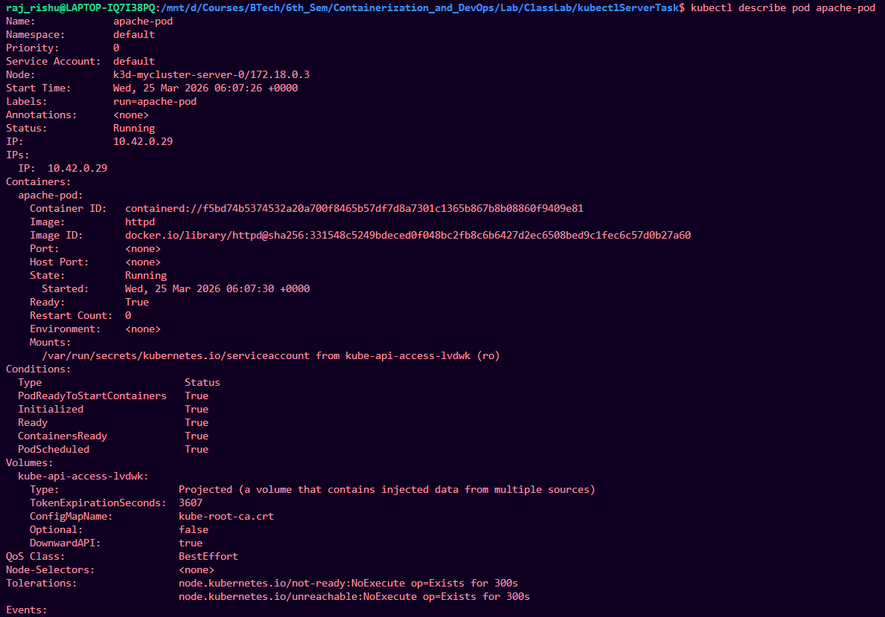

---

## Step 3: Access the App

```bash
kubectl port-forward pod/apache-pod 8081:80
```

Open:

```
http://localhost:8081
```
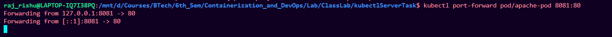

We see:
→ Apache default page (“It works!”)

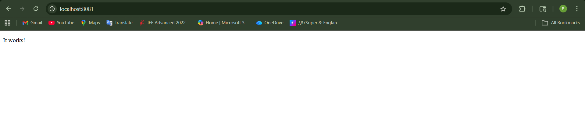

---

## Step 4: Delete Pod

```bash
kubectl delete pod apache-pod
```


---

### Insight

Same as before:

* Pod disappears permanently
* No self-healing

---

# Task: Convert to Deployment

## Step 5: Create Deployment

```bash
kubectl create deployment apache --image=httpd
```

Check:

```bash
kubectl get deployments
kubectl get pods
```

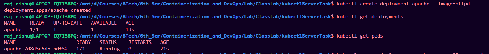

---

## Step 6: Expose Deployment

```bash
kubectl expose deployment apache --port=80 --type=NodePort
```

Access again:

```bash
kubectl port-forward service/apache 8082:80
```

Open:

```
http://localhost:8082
```

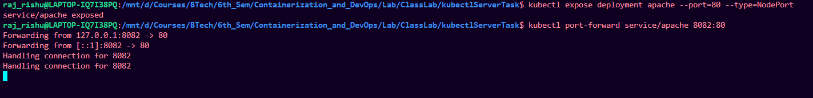


---

# Task: Modify Behavior

## Step 7: Scale Deployment

```bash
kubectl scale deployment apache --replicas=2
```

Check:

```bash
kubectl get pods
```

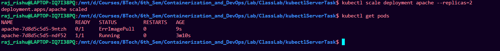

### Observe

* Multiple pods running same app

---


# Task: Debugging Scenario


## Step 9: Break the App

```bash
kubectl set image deployment/apache httpd=wrongimage
```

Check:

```bash
kubectl get pods
```
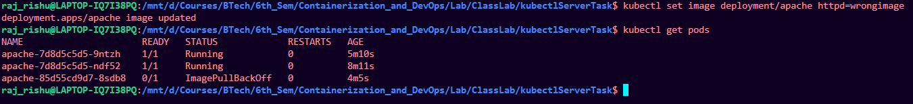

---

## Step 10: Diagnose

```bash
kubectl describe pod <pod-name>
```

Look for:

* `ImagePullBackOff`
* error messages

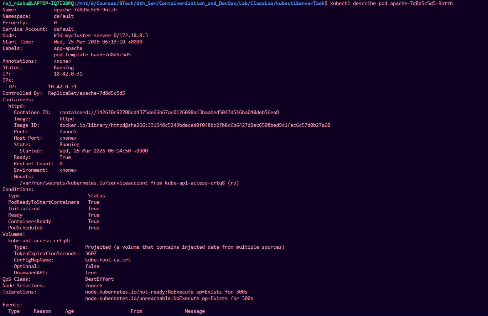
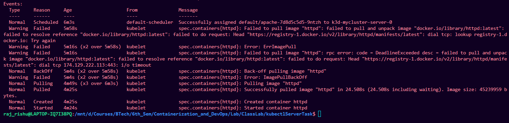

---

## Step 11: Fix It

```bash
kubectl set image deployment/apache httpd=httpd
```

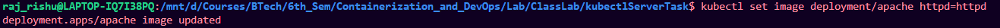

---

# Task: Explore Inside Container (Important Skill)


## Step 12: Exec into Pod

```bash
kubectl exec -it <pod-name> -- /bin/bash
```

Now inside container:

```bash
ls /usr/local/apache2/htdocs
```

This is where web files are stored.

Exit:

```bash
exit
```

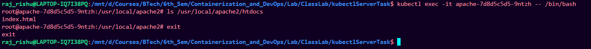

---

# Task: Observe Self-Healing


## Step 13: Delete One Pod

```bash
kubectl delete pod <one-pod-name>
```

Watch:

```bash
kubectl get pods -w
```

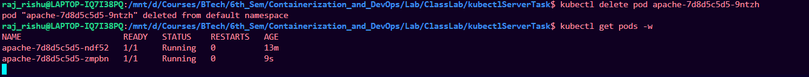

---

### Insight

* Deployment recreates pod automatically

---

# Task: Cleanup

```bash
kubectl delete deployment apache
kubectl delete service apache
```
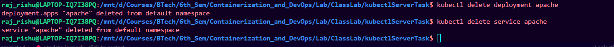

---

# What You Learned (Important)

This task is better than nginx because:

* You accessed actual web output
* You explored container filesystem
* You practiced debugging real errors
* You saw scaling + recovery

---

# Optional Next Challenge 

Modify container at runtime:

```bash
kubectl exec -it <pod-name> -- /bin/bash
```

Then:

```bash
echo "Hello from Kubernetes" > /usr/local/apache2/htdocs/index.html
```

Refresh browser.

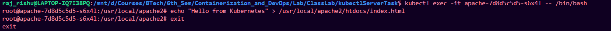


---