# **Lab Manual – Experiment 1**

Comparison of Virtual Machines (VMs) and Containers using Ubuntu and Nginx

---

## **Objective**

1. To understand the conceptual and practical differences between Virtual Machines and Containers.
2. To install and configure a Virtual Machine using VirtualBox and Vagrant on Windows.
3. To install and configure Containers using Docker inside WSL.
4. To deploy an Ubuntu-based Nginx web server in both environments.
5. To compare resource utilization, performance, and operational characteristics of VMs and Containers.

---

## **Software and Hardware Requirements**

### **Hardware**

* 64-bit system with virtualization support enabled in BIOS
* Minimum 8 GB RAM (4 GB minimum acceptable)
* Internet connection

### **Software (Windows Host)**

* Oracle VirtualBox
* Vagrant
* Windows Subsystem for Linux (WSL 2)
* Ubuntu (WSL distribution)
* Docker Engine (docker.io)

### **Software (macOS – for troubleshooting/reference)**

* Oracle VirtualBox (Intel Macs only)
* Vagrant
* Docker Desktop (alternative if WSL is not applicable)

---

## **Theory**

### **Virtual Machine (VM)**

A Virtual Machine emulates a complete physical computer, including its own operating system kernel, hardware drivers, and user space. Each VM runs on top of a hypervisor.

**Characteristics:**

* Full OS per VM
* Higher resource usage
* Strong isolation
* Slower startup time

### **Container**

Containers virtualize at the operating system level. They share the host OS kernel while isolating applications and dependencies in user space.

**Characteristics:**

* Shared kernel
* Lightweight
* Fast startup
* Efficient resource usage

---

## **Experiment Setup – Part A: Virtual Machine (Windows)**

### **Step 1: Install VirtualBox**

1. Download VirtualBox from the official website.
2. Run the installer and keep default options.
3. Restart the system if prompted.

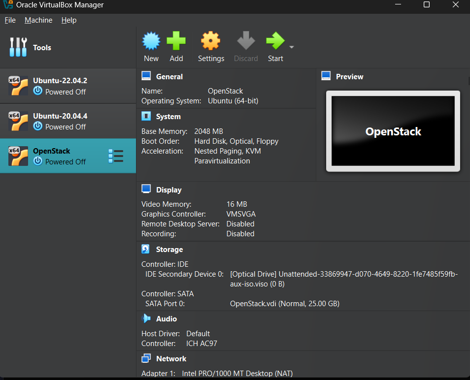


### **Step 2: Install Vagrant**

1. Download Vagrant for Windows.
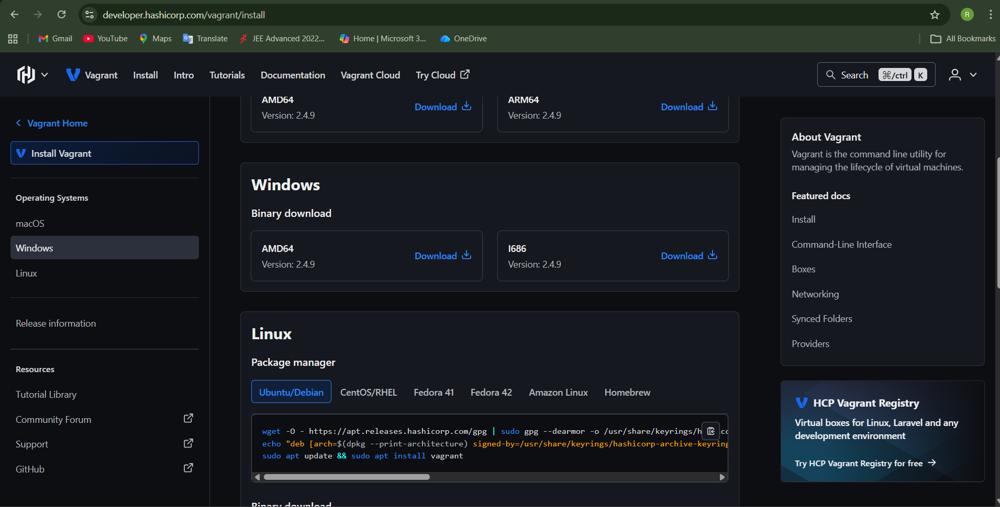
2. Install using default settings.
3. Verify installation:

   ```bash
   vagrant --version
   ```
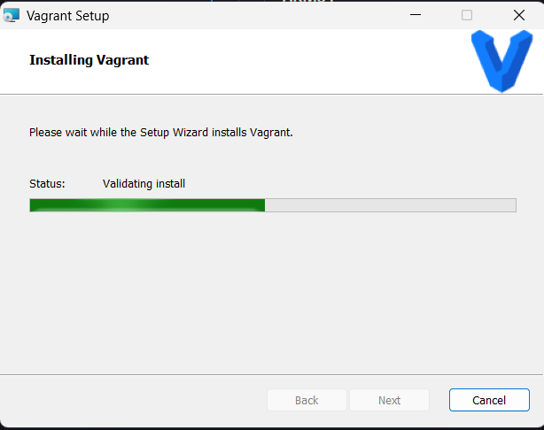


### **Step 3: Create Ubuntu VM using Vagrant**

1. Create a new directory.
2. Initialize Vagrant with Ubuntu box:

   ```bash
   vagrant init ubuntu/jammy64
   ```

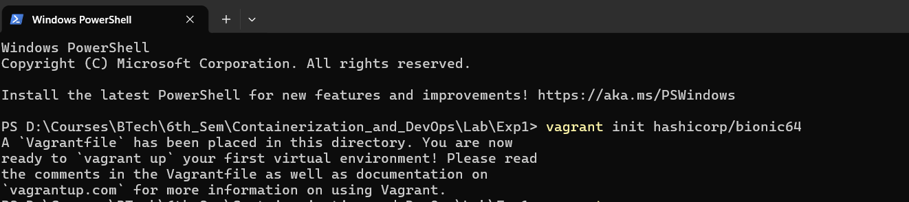

3. Start the VM:

   ```bash
   vagrant up
   ```
   


4. Access the VM:

   ```bash
   vagrant ssh
   ```

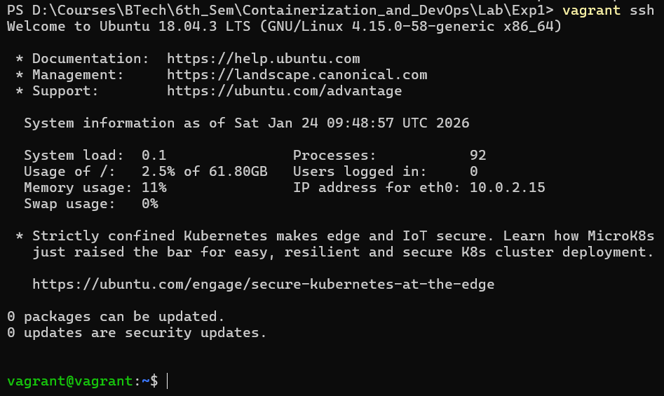

### **Step 4: Install Nginx inside VM**

```bash
sudo apt update
sudo apt install -y nginx
sudo systemctl start nginx
```

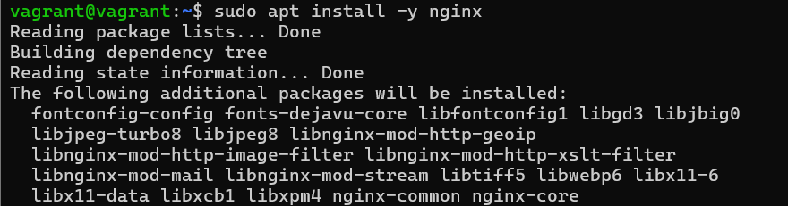


### **Step 5: Verify Nginx**

```bash
curl localhost
```
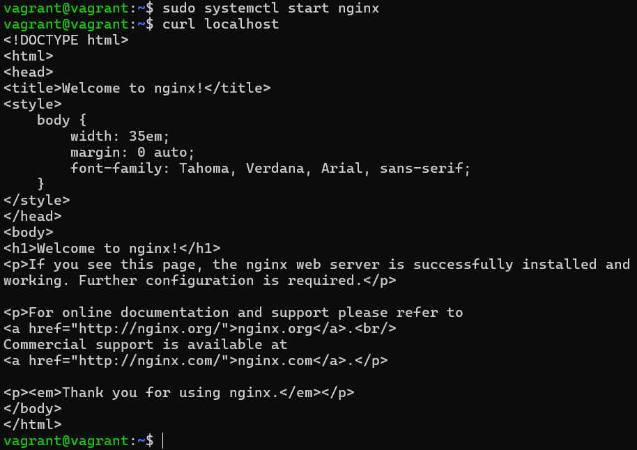

### **Step 6: Check Utilization**

### Utilization When VM Running: 
CPU:

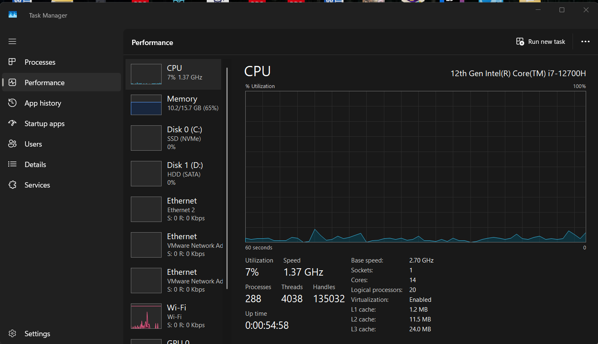

Memory:


### Stop and remove vm

```bash
vagrant halt
vagrant destroy
```

---

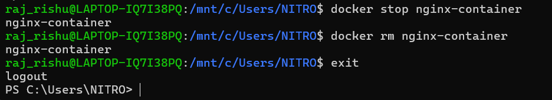

### Utilization When VM Stopped: 
CPU:

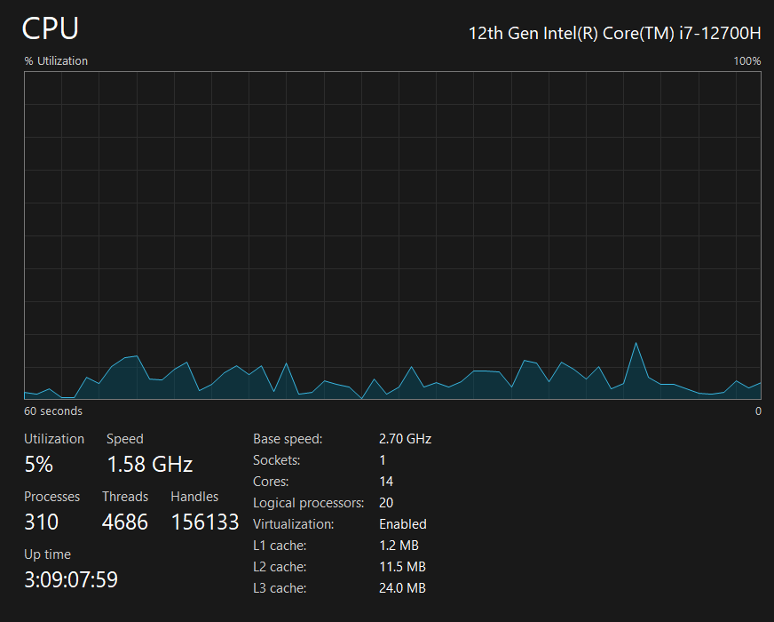

Memory:

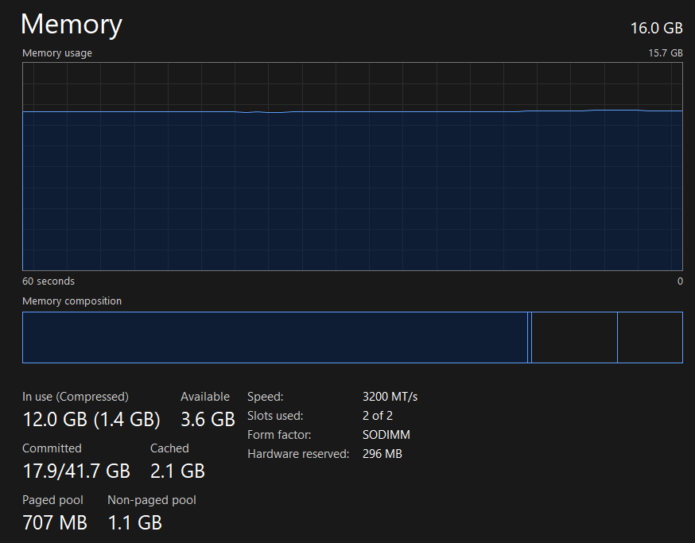


## **Experiment Setup – Part B: Containers using WSL (Windows)**

### **Step 1: Install WSL 2**

```powershell
wsl --install
```

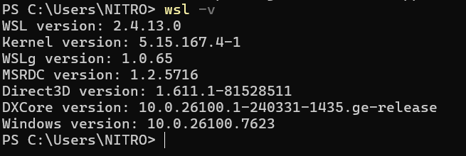

Reboot the system after installation.

### **Step 2: Install Ubuntu on WSL**

```powershell
wsl --install -d Ubuntu
```


### **Step 3: Install Docker Engine inside WSL**

```bash
sudo apt update
sudo apt install -y docker.io
sudo systemctl start docker
sudo usermod -aG docker $USER
```

Logout and login again to apply group changes.

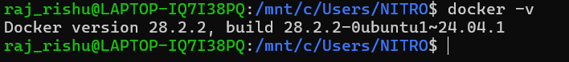


### **Step 4: Run Ubuntu Container with Nginx**

```bash
docker pull ubuntu

docker run -d -p 8080:80 --name nginx-container nginx
```


### **Step 5: Verify Nginx in Container**

```bash
curl localhost:8080
```

---


### **Step 6: Check Utilization**

### Utilization When Container Running: 
CPU:

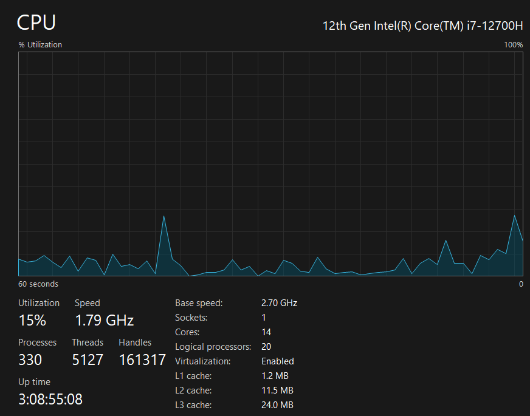

Memory:

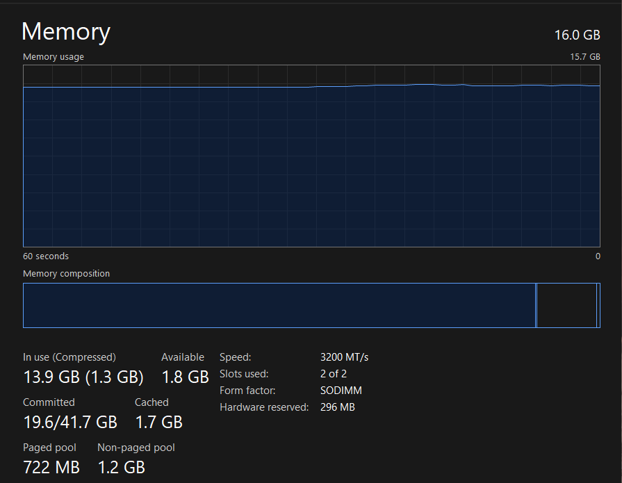


### Stop and remove vm

```bash
vagrant halt
vagrant destroy
```

---


### Utilization When Container Stopped: 
CPU:


Memory:

