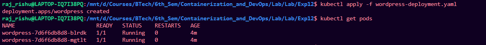
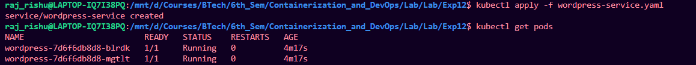
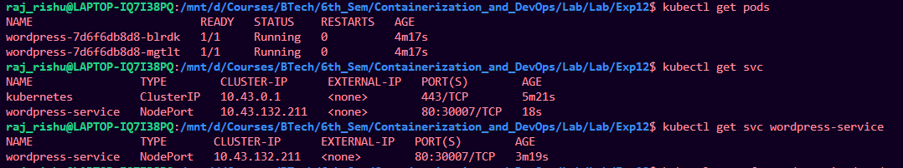
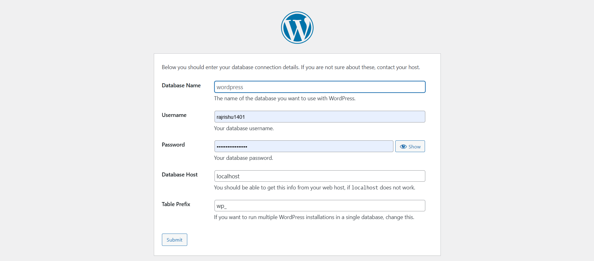
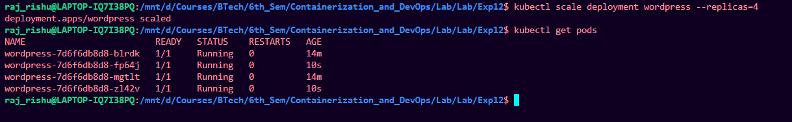
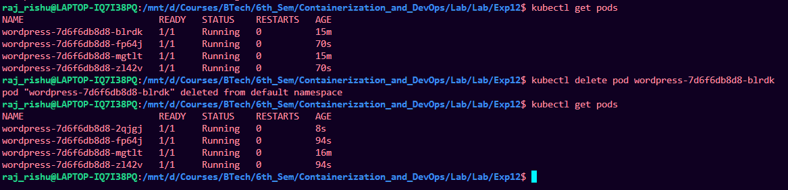

# Experiment 12: Study and Analyse Container Orchestration using Kubernetes

## Objective
Learn why Kubernetes is used, its basic concepts, and how to deploy, scale, and fix apps using Kubernetes commands.

---

## Why Kubernetes over Docker Swarm?

| Reason | Explanation |
|:--------|:-------------|
| Industry standard | Most companies use Kubernetes |
| Powerful scheduling | Automatically decides where to run your app |
| Large ecosystem | Many tools and plugins available |
| Cloud-native support | Works on AWS, Google Cloud, Azure, etc. |

---

## Core Kubernetes Concepts (Simple Explanation)

| Docker Concept | Kubernetes Equivalent | What it means |
|---------------|----------------------|----------------|
| Container | **Pod** | A pod is a group of one or more containers. Smallest unit in K8s. |
| Compose service | **Deployment** | Describes how your app should run (e.g., 2 copies, which image to use) |
| Load balancing | **Service** | Exposes your app to the outside world or other pods |
| Scaling | **ReplicaSet** | Ensures a certain number of pod copies are always running |

---

# Hands-On Lab (Using k3d or Minikube)

> **Note:** We assume you already have `kubectl` and a cluster (k3d or Minikube) installed. If not, ask your instructor.

---

## Task 1: Create a Deployment

A **deployment** tells Kubernetes:  
- Which container image to use (e.g., WordPress)  
- How many copies (replicas) to run  
- How to identify the pods (labels)

### Step 1: Create a file `wordpress-deployment.yaml`

```yaml
# wordpress-deployment.yaml
apiVersion: apps/v1          # Which Kubernetes API to use
kind: Deployment             # Type of resource
metadata:
  name: wordpress            # Name of this deployment
spec:
  replicas: 2                # Run 2 identical pods
  selector:
    matchLabels:
      app: wordpress         # Pods with this label belong to this deployment
  template:                  # Template for the pods
    metadata:
      labels:
        app: wordpress       # Label applied to each pod
    spec:
      containers:
      - name: wordpress
        image: wordpress:latest   # Docker image
        ports:
        - containerPort: 80       # Port inside the container
```

### Step 2: Apply the deployment

```bash
kubectl apply -f wordpress-deployment.yaml
```


**What happens?**  
Kubernetes creates 2 pods running WordPress.

---

## Task 2: Expose the Deployment as a Service

Pods are **temporary** (they can be deleted or recreated).  
A **Service** gives them a fixed IP and exposes them to the outside.

### Step 1: Create a file `wordpress-service.yaml`

```yaml
# wordpress-service.yaml
apiVersion: v1
kind: Service
metadata:
  name: wordpress-service
spec:
  type: NodePort            # Exposes service on a port of each node (VM)
  selector:
    app: wordpress          # Send traffic to pods with this label
  ports:
    - port: 80              # Service port
      targetPort: 80        # Pod port
      nodePort: 30007       # External port (range: 30000–32767)
```

### Step 2: Apply the service

```bash
kubectl apply -f wordpress-service.yaml
```



---

## Task 3: Verify Everything

Check if pods are running:
```bash
kubectl get pods
```
**Expected output:**  
```
NAME                         READY   STATUS    RESTARTS   AGE
wordpress-xxxxx-yyyyy        1/1     Running   0          1m
wordpress-xxxxx-zzzzz        1/1     Running   0          1m
```

Check the service:
```bash
kubectl get svc
```
**Expected output:**  
```
NAME                 TYPE       CLUSTER-IP     PORT(S)        AGE
wordpress-service    NodePort   10.43.x.x      80:30007/TCP   1m
```



### Access WordPress in your browser

```
http://<node-ip>:30007
```



> **How to find node-ip in k3d/minikube?**  
> - **Minikube:** `minikube ip`  
> - **k3d:** Usually `localhost`

---

## Task 4: Scale the Deployment

Increase the number of pods from 2 to 4:

```bash
kubectl scale deployment wordpress --replicas=4
```

Verify:
```bash
kubectl get pods
```
You should now see 4 running pods.



**Why scale?** More traffic → more copies → better performance.

---

## Task 5: Self-Healing Demonstration

Kubernetes automatically replaces failed pods.

Delete one pod manually:
```bash
# First, get pod names
kubectl get pods

# Delete one (replace <pod-name>)
kubectl delete pod <pod-name>
```

Now check pods again:
```bash
kubectl get pods
```



You will still see 4 pods — the deleted one was **automatically recreated**.

**Why?** The deployment ensures the desired number (4) is always running.

---

# PART C – Swarm vs Kubernetes (Simple Comparison)

| Feature     | Docker Swarm                | Kubernetes                  |
|-------------|-----------------------------|-----------------------------|
| Setup       | Very easy                   | More complex                |
| Scaling     | Basic                       | Advanced (auto-scaling)     |
| Ecosystem   | Small                       | Huge (monitoring, logging)  |
| Industry use| Rare                        | Standard                    |

> **Verdict:** Learn Kubernetes — it's what companies use.

---