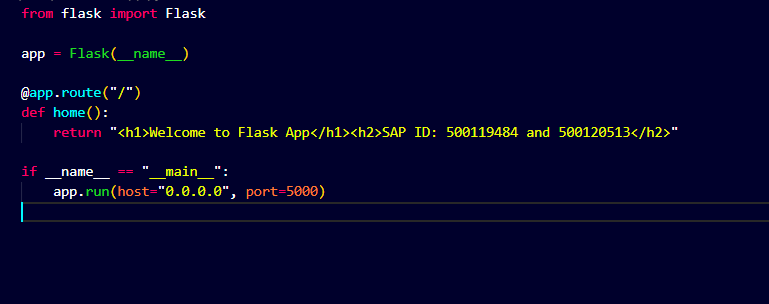
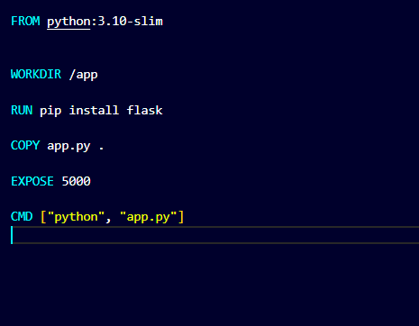
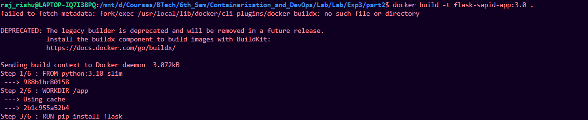
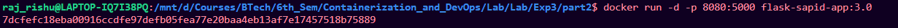
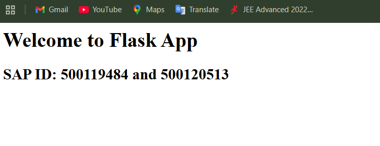

# Hosting Flask app on docker

## Create docker file

1. create separate folder
2. create a python program:



3. create docker file with commands:

```bash

FROM python:3.10-slim

WORKDIR /app

RUN pip install flask

COPY app.py .

EXPOSE 5000

CMD ["python", "app.py"]


```



---

## Build and run image

1. Build the image from the docker file

```bash
docker build -t flask-sapid-app .
```




2. Check Image:

```bash
docker images
```


3. Run the image:

```bash
docker run -d -p 8080:5000 flask-sapid-app:3.0
```



## Result

Python program running



