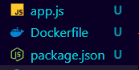
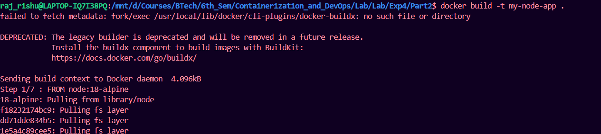
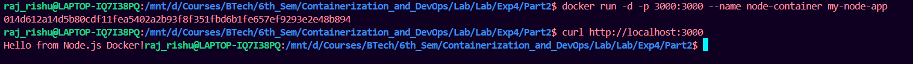

## **Part 7: Node.js Example (Quick Version)**

### **Step 1: Node.js Application**
```bash
mkdir my-node-app
cd my-node-app
```

**`app.js`:**
```javascript
const express = require('express');
const app = express();
const port = 3000;

app.get('/', (req, res) => {
    res.send('Hello from Node.js Docker!');
});

app.get('/health', (req, res) => {
    res.json({ status: 'healthy' });
});

app.listen(port, () => {
    console.log(`Server running on port ${port}`);
});
```

**`package.json`:**
```json
{
  "name": "node-docker-app",
  "version": "1.0.0",
  "main": "app.js",
  "dependencies": {
    "express": "^4.18.2"
  }
}
```

### **Step 2: Node.js Dockerfile**
```dockerfile
FROM node:18-alpine

WORKDIR /app

COPY package*.json ./
RUN npm install --only=production

COPY app.js .

EXPOSE 3000

CMD ["node", "app.js"]
```




### **Step 3: Build and Run**
```bash
# Build image
docker build -t my-node-app .

# Run container
docker run -d -p 3000:3000 --name node-container my-node-app

# Test
curl http://localhost:3000
```





---
## **Essential Docker Commands Cheatsheet**

| Command | Purpose | Example |
|---------|---------|---------|
| `docker build` | Build image | `docker build -t myapp .` |
| `docker run` | Run container | `docker run -p 3000:3000 myapp` |
| `docker ps` | List containers | `docker ps -a` |
| `docker images` | List images | `docker images` |
| `docker tag` | Tag image | `docker tag myapp:latest myapp:v1` |
| `docker login` | Login to Dockerhub using username and password or token | `echo "token" | docker login -u username --password-stdin` |
| `docker push` | Push to registry | `docker push username/myapp` |
| `docker pull` | Pull from registry | `docker pull username/myapp` |
| `docker rm` | Remove container | `docker rm container-name` |
| `docker rmi` | Remove image | `docker rmi image-name` |
| `docker logs` | View logs | `docker logs container-name` |
| `docker exec` | Execute command | `docker exec -it container-name bash` |

---

## **Common Workflow Summary**

### **Development Workflow:**
```bash
# 1. Create Dockerfile and .dockerignore
# 2. Build image
docker build -t myapp .

# 3. Test locally
docker run -p 8080:8080 myapp

# 4. Tag for production
docker tag myapp:latest myapp:v1.0

# 5. Push to registry
docker push myapp:v1.0
```


### **Production Workflow:**
```bash
# 1. Pull from registry
docker pull myapp:v1.0

# 2. Run in production
docker run -d -p 80:8080 --name prod-app myapp:v1.0

# 3. Monitor
docker logs -f prod-app
```


---

## **Key Takeaways**

1. **Dockerfile** defines how to build your image
2. **.dockerignore** excludes unnecessary files (important for security and performance)
3. **Tagging** helps version and organize images
4. **Multi-stage builds** create smaller, more secure production images
5. **Docker Hub** allows sharing and distributing images
6. **Always test** images locally before publishing

---

## **Cleanup**
```bash
# Remove all stopped containers
docker container prune

# Remove unused images
docker image prune

# Remove everything unused
docker system prune -a
```
