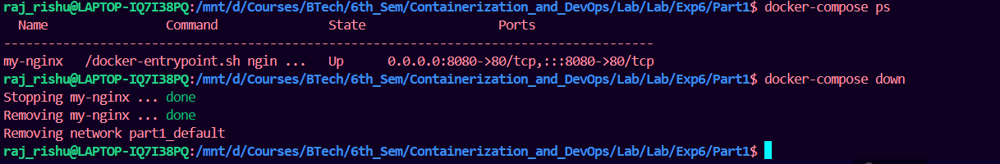
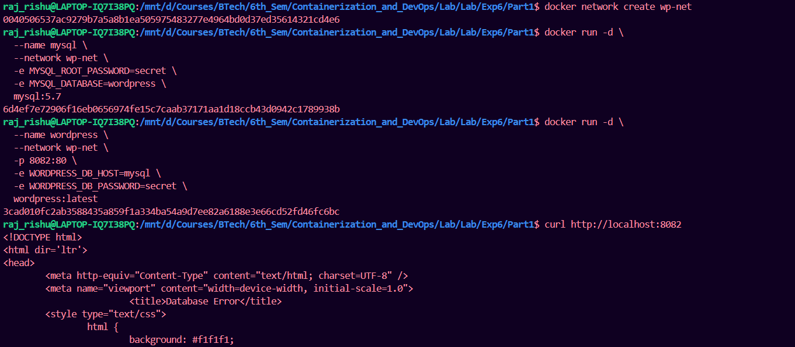
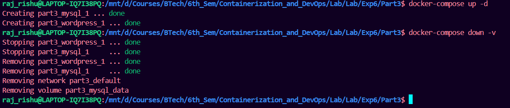
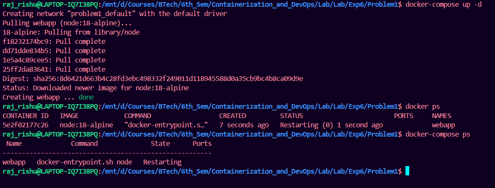
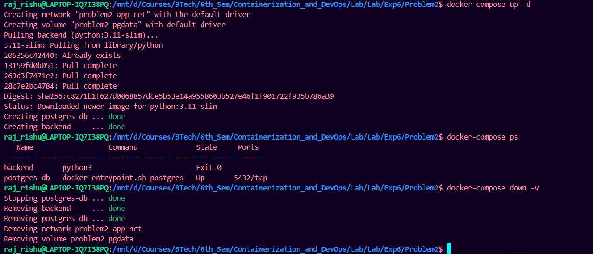
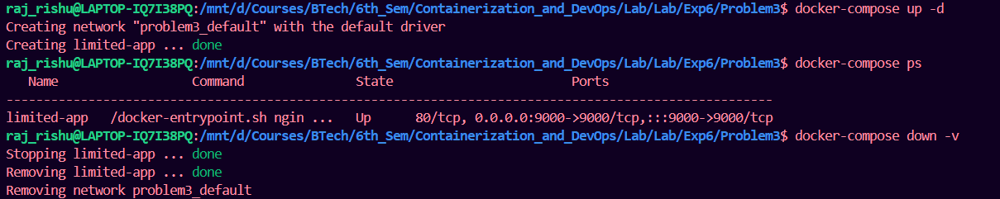
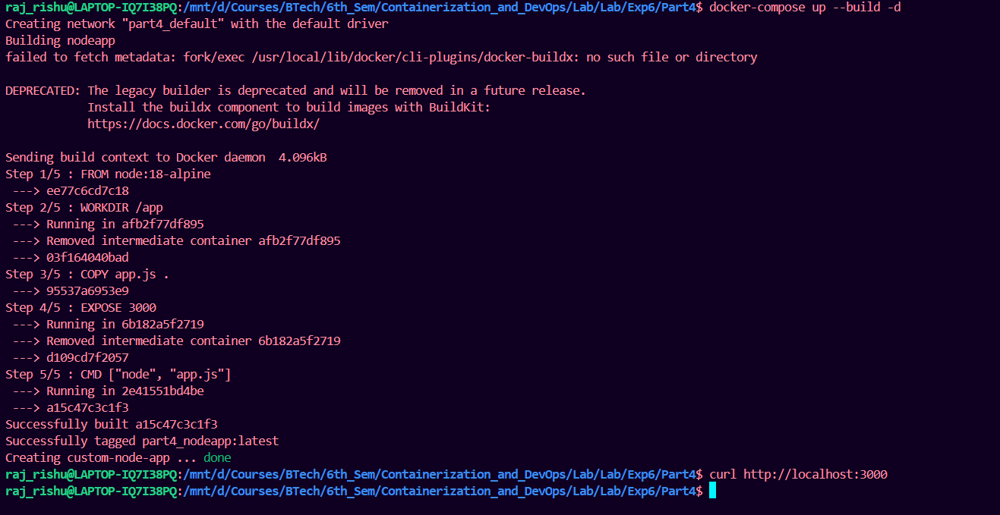
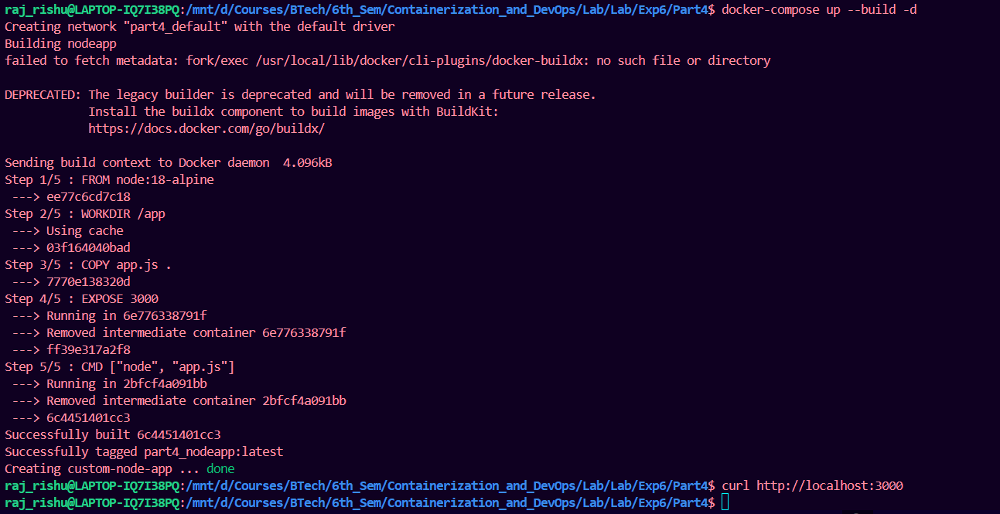
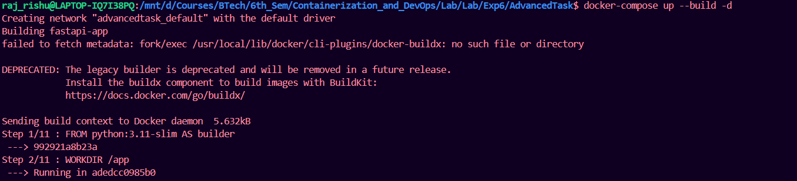
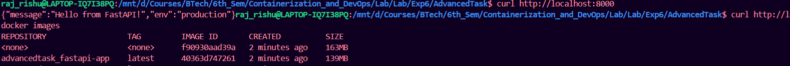

# Experiment 6

## Title: Comparison of Docker Run and Docker Compose

---

# PART A – THEORY

## 1. Objective

To understand the relationship between `docker run` and Docker Compose, and to compare their configuration syntax and use cases.

---

## 2. Background Theory

### 2.1 Docker Run (Imperative Approach)

The `docker run` command is used to create and start a container from an image. It requires explicit flags for:

* Port mapping (`-p`)
* Volume mounting (`-v`)
* Environment variables (`-e`)
* Network configuration (`--network`)
* Restart policies (`--restart`)
* Resource limits (`--memory`, `--cpus`)
* Container name (`--name`)

This approach is **imperative**, meaning you specify step-by-step instructions.

Example:

```bash
docker run -d \
  --name my-nginx \
  -p 8080:80 \
  -v ./html:/usr/share/nginx/html \
  -e NGINX_HOST=localhost \
  --restart unless-stopped \
  nginx:alpine
```

---

### 2.2 Docker Compose (Declarative Approach)

Docker Compose uses a YAML file (`docker-compose.yml`) to define services, networks, and volumes in a structured format.

Instead of multiple `docker run` commands, a single command is used:

```bash
docker compose up -d
```

Compose is **declarative**, meaning you define the desired state of the application.

Equivalent Compose file:

```yaml
version: '3.8'

services:
  nginx:
    image: nginx:alpine
    container_name: my-nginx
    ports:
      - "8080:80"
    volumes:
      - ./html:/usr/share/nginx/html
    environment:
      NGINX_HOST: localhost
    restart: unless-stopped
```


---

## 3. Mapping: Docker Run vs Docker Compose

| Docker Run Flag     | Docker Compose Equivalent        |
| ------------------- | -------------------------------- |
| `-p 8080:80`        | `ports:`                         |
| `-v host:container` | `volumes:`                       |
| `-e KEY=value`      | `environment:`                   |
| `--name`            | `container_name:`                |
| `--network`         | `networks:`                      |
| `--restart`         | `restart:`                       |
| `--memory`          | `deploy.resources.limits.memory` |
| `--cpus`            | `deploy.resources.limits.cpus`   |
| `-d`                | `docker compose up -d`           |

---

## 4. Advantages of Docker Compose

1. Simplifies multi-container applications
2. Provides reproducibility
3. Version controllable configuration
4. Unified lifecycle management
5. Supports service scaling

Example:

```bash
docker compose-up --scale web=3
```

---

# PART B – PRACTICAL TASK

## Task 1: Single Container Comparison

### Step 1: Run Nginx Using Docker Run

Execute:

```bash
docker run -d \
  --name lab-nginx \
  -p 8081:80 \
  -v $(pwd)/html:/usr/share/nginx/html \
  nginx:alpine
```

Verify:

```bash
docker ps
```

Access:

```
http://localhost:8081
```

Stop and remove container:

```bash
docker stop lab-nginx
docker rm lab-nginx
```


---

### Step 2: Run Same Setup Using Docker Compose

Create `docker-compose.yml`:

```yaml
version: '3.8'

services:
  nginx:
    image: nginx:alpine
    container_name: lab-nginx
    ports:
      - "8081:80"
    volumes:
      - ./html:/usr/share/nginx/html
```

Run:

```bash
docker compose-up -d
```

Verify:

```bash
docker compose ps
```

Stop:

```bash
docker compose down
```



---

## Task 2: Multi-Container Application

### Objective:

Deploy WordPress with MySQL using:

1. Docker Run (manual way)
2. Docker Compose (structured way)

---

### A. Using Docker Run

1. Create network:

```bash
docker network create wp-net
```

2. Run MySQL:

```bash
docker run -d \
  --name mysql \
  --network wp-net \
  -e MYSQL_ROOT_PASSWORD=secret \
  -e MYSQL_DATABASE=wordpress \
  mysql:5.7
```

3. Run WordPress:

```bash
docker run -d \
  --name wordpress \
  --network wp-net \
  -p 8082:80 \
  -e WORDPRESS_DB_HOST=mysql \
  -e WORDPRESS_DB_PASSWORD=secret \
  wordpress:latest
```

Test:

```
http://localhost:8082
```


---

### B. Using Docker Compose

Create `docker-compose.yml`:

```yaml
version: '3.8'

services:
  mysql:
    image: mysql:5.7
    environment:
      MYSQL_ROOT_PASSWORD: secret
      MYSQL_DATABASE: wordpress
    volumes:
      - mysql_data:/var/lib/mysql

  wordpress:
    image: wordpress:latest
    ports:
      - "8082:80"
    environment:
      WORDPRESS_DB_HOST: mysql
      WORDPRESS_DB_PASSWORD: secret
    depends_on:
      - mysql

volumes:
  mysql_data:
```

Run:

```bash
docker compose-up -d
```

Stop:

```bash
docker compose-down -v
```


---


# PART C – CONVERSION & BUILD-BASED TASKS

## Task 3: Convert Docker Run to Docker Compose

### Problem 1: Basic Web Application

### Given Docker Run Command:

```bash
docker run -d \
  --name webapp \
  -p 5000:5000 \
  -e APP_ENV=production \
  -e DEBUG=false \
  --restart unless-stopped \
  node:18-alpine
```

---

### Student Task:

1. Write an equivalent `docker-compose.yml`
2. Ensure:

   * Same container name
   * Same port mapping
   * Same environment variables
   * Same restart policy
3. Run using:

   ```bash
   docker compose up -d
   ```
4. Verify using:

   ```bash
   docker compose ps
   ```

### Solution:

docker-compose file:

```yaml
version: '3.8'

services:
  webapp:
    image: node:18-alpine
    container_name: webapp
    ports:
      - "5000:5000"
    environment:
      APP_ENV: production
      DEBUG: "false"
    restart: unless-stopped
```




---

## Problem 2: Volume + Network Configuration

### Given Docker Run Commands:

```bash
docker network create app-net
```

```bash
docker run -d \
  --name postgres-db \
  --network app-net \
  -e POSTGRES_USER=admin \
  -e POSTGRES_PASSWORD=secret \
  -v pgdata:/var/lib/postgresql/data \
  postgres:15
```

```bash
docker run -d \
  --name backend \
  --network app-net \
  -p 8000:8000 \
  -e DB_HOST=postgres-db \
  -e DB_USER=admin \
  -e DB_PASS=secret \
  python:3.11-slim
```

---

### Student Task:

1. Create a single `docker-compose.yml` file that:

   * Defines both services
   * Creates named volume `pgdata`
   * Creates custom network `app-net`
   * Uses `depends_on`
2. Bring up services using one command.
3. Stop and remove everything properly.

### Solution:

docker-compose file:

```yaml
version: '3.8'

services:
  postgres-db:
    image: postgres:15
    container_name: postgres-db
    environment:
      POSTGRES_USER: admin
      POSTGRES_PASSWORD: secret
    volumes:
      - pgdata:/var/lib/postgresql/data
    networks:
      - app-net

  backend:
    image: python:3.11-slim
    container_name: backend
    ports:
      - "8000:8000"
    environment:
      DB_HOST: postgres-db
      DB_USER: admin
      DB_PASS: secret
    depends_on:
      - postgres-db
    networks:
      - app-net

volumes:
  pgdata:

networks:
  app-net:

```




---

## Task 4: Resource Limits Conversion

### Given Docker Run Command:

```bash
docker run -d \
  --name limited-app \
  -p 9000:9000 \
  --memory="256m" \
  --cpus="0.5" \
  --restart always \
  nginx:alpine
```

---

### Student Task:

1. Convert this to Docker Compose.
2. Add resource limits using:

   ```yaml
   deploy:
     resources:
       limits:
   ```
3. Explain:

   * When `deploy` works
   * Difference between normal Compose mode and Swarm mode

### Solution:

docker-compose file:

```yaml
version: '3.8'

services:
  limited-app:
    image: nginx:alpine
    container_name: limited-app
    ports:
      - "9000:9000"
    restart: always

    deploy:
      resources:
        limits:
          memory: 256M
          cpus: "0.5"
```


#### When `deploy` Works

- The `deploy` section works **only in Docker Swarm mode**.
- It is applied when using:
  ```bash
  docker stack deploy

#### Difference: Compose Mode vs Swarm Mode

Normal Compose Mode

- Used for **local development**
- Single-node only
- `deploy` section is ignored

Run using:
```bash
docker compose up
```
Swarm Mode
- Used for **production and clustering**
- Supports **multi-node setup**
- Supports **scaling and rolling updates**
- `deploy` section works

Run using:

```bash
docker stack deploy
```

---

# PART D – USING DOCKERFILE INSTEAD OF STANDARD IMAGE

Now increase difficulty.

Instead of using prebuilt images like:

```yaml
image: node:18-alpine
```

Students must:

* Create their own Dockerfile
* Build image using Compose
* Run container from that build

---

## Task 5: Replace Standard Image with Dockerfile (Node App)

### Scenario

You are given:

```bash
docker run -d -p 3000:3000 node:18-alpine
```

Now instead of directly using `node:18-alpine`, you must:

1. Create a simple Node.js app
2. Write a Dockerfile
3. Use Docker Compose `build:` option

---

### Step 1: Create `app.js`

```javascript
const http = require('http');

http.createServer((req, res) => {
  res.end("Docker Compose Build Lab");
}).listen(3000);
```

---

### Step 2: Create `Dockerfile`

```dockerfile
FROM node:18-alpine

WORKDIR /app

COPY app.js .

EXPOSE 3000

CMD ["node", "app.js"]
```

---

### Step 3: Create `docker-compose.yml`

```yaml
version: '3.8'

services:
  nodeapp:
    build:
      context: .
      dockerfile: Dockerfile
    container_name: custom-node-app
    ports:
      - "3000:3000"
```


---


### Student Task:

1. Build and run using:

   ```bash
   docker compose up --build -d
   ```
2. Verify in browser:

   ```
   http://localhost:3000
   ```
3. Modify `app.js` message.
4. Rebuild and observe changes.



---

# Advanced Build Challenge

## Task 6: Multi-Stage Dockerfile with Compose

### Requirement:

Create a simple Python FastAPI or Node production-ready app using:

* Multi-stage Dockerfile
* Smaller final image
* Use Compose to build it

---

### Must:

1. Write multi-stage Dockerfile
2. Use `build:` in Compose
3. Add environment variables
4. Add volume mount for development mode
5. Compare image size:

   ```bash
   docker images
   ```

### Solution:

DockerFile:

```dockerfile
# ---------- Stage 1: Builder ----------
FROM python:3.11-slim AS builder

WORKDIR /app

COPY app/requirements.txt .

RUN pip install --upgrade pip \
    && pip install --prefix=/install -r requirements.txt

# ---------- Stage 2: Production ----------
FROM python:3.11-slim

WORKDIR /app

COPY --from=builder /install /usr/local
COPY app/ .

ENV PYTHONUNBUFFERED=1

EXPOSE 8000

CMD ["uvicorn", "main:app", "--host", "0.0.0.0", "--port", "8000"]

```

docker-compose file:

```yaml
version: "3.8"

services:
  fastapi-app:
    build: .
    container_name: fastapi-app
    ports:
      - "8000:8000"
    environment:
      APP_ENV: production
    volumes:
      - ./app:/app   # For development mode (auto reload if used)
    restart: unless-stopped
```



