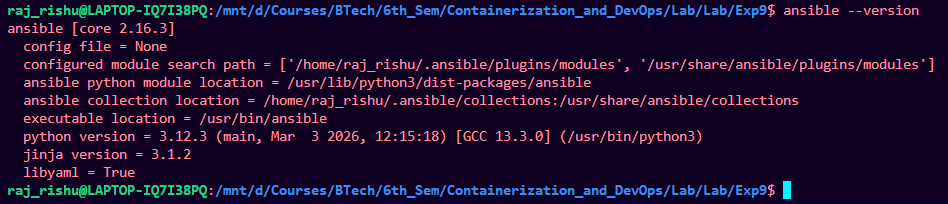
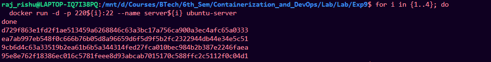
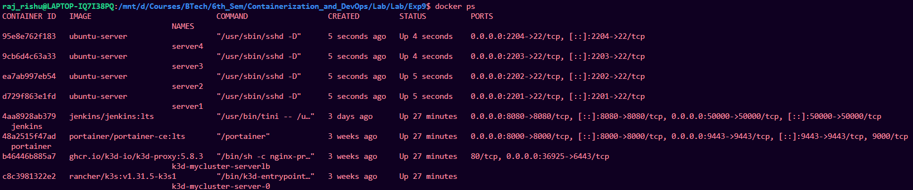
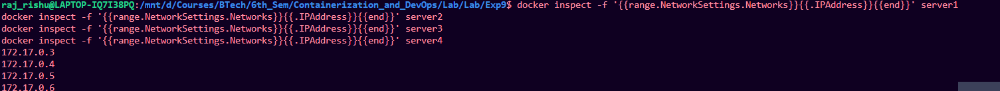
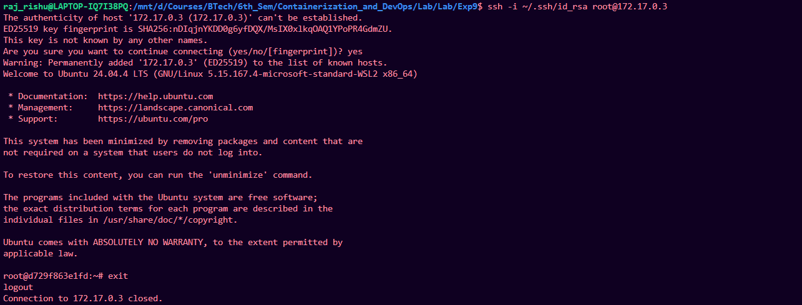
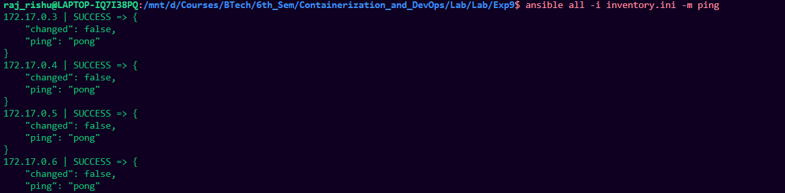
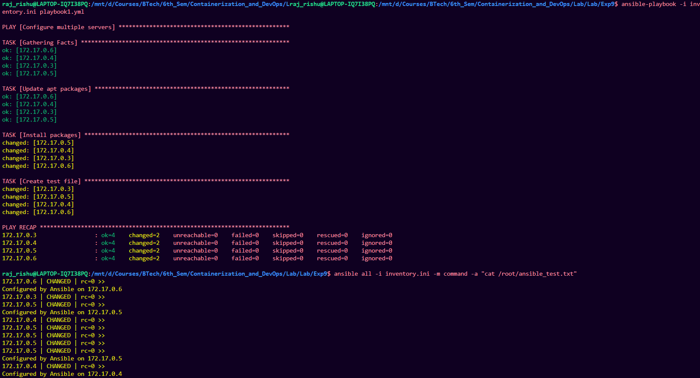
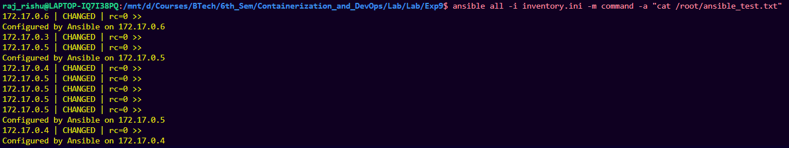
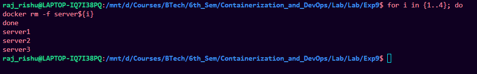

# Experiment 9 – Ansible Automation Using Docker Servers

## Overview

This experiment demonstrates how **Ansible** can be used to automate configuration and management of multiple servers. Docker containers are used as test servers, and Ansible connects to them via SSH to execute tasks defined in a playbook.

---

# Objective

* Install and configure Ansible.
* Create Docker containers to act as servers.
* Establish SSH key-based authentication.
* Create an Ansible inventory.
* Execute Ansible commands and playbooks to configure servers automatically.

---

# Prerequisites

* Ubuntu/WSL environment
* Docker installed
* Python installed
* Internet connection

---

# Step 1: Install Ansible

Update packages and install Ansible.

```bash
sudo apt update -y
sudo apt install ansible -y
```

Verify installation:

```bash
ansible --version
```



Test Ansible locally:

```bash
ansible localhost -m ping
```

Expected Output:

```
localhost | SUCCESS => {
  "changed": false,
  "ping": "pong"
}
```


---

# Step 2: Generate SSH Key Pair

Create SSH keys for authentication between control node and servers.

```bash
ssh-keygen -t rsa -b 4096
```

Copy the keys to the working directory:

```bash
cp ~/.ssh/id_rsa .
cp ~/.ssh/id_rsa.pub .
```

---

# Step 3: Create Dockerfile for SSH Server

Create a file named `Dockerfile`.

```bash
nano Dockerfile
```

Paste the following configuration:

```dockerfile
FROM ubuntu

RUN apt update -y
RUN apt install -y python3 python3-pip openssh-server
RUN mkdir -p /var/run/sshd

RUN mkdir -p /run/sshd && \
    echo 'root:password' | chpasswd && \
    sed -i 's/#PermitRootLogin prohibit-password/PermitRootLogin yes/' /etc/ssh/sshd_config && \
    sed -i 's/#PasswordAuthentication yes/PasswordAuthentication no/' /etc/ssh/sshd_config && \
    sed -i 's/#PubkeyAuthentication yes/PubkeyAuthentication yes/' /etc/ssh/sshd_config

RUN mkdir -p /root/.ssh && chmod 700 /root/.ssh

COPY id_rsa /root/.ssh/id_rsa
COPY id_rsa.pub /root/.ssh/authorized_keys

RUN chmod 600 /root/.ssh/id_rsa
RUN chmod 644 /root/.ssh/authorized_keys

EXPOSE 22

CMD ["/usr/sbin/sshd", "-D"]
```

---

# Step 4: Build Docker Image

Build the Docker image named `ubuntu-server`.

```bash
docker build -t ubuntu-server .
```

---

# Step 5: Start Multiple Docker Servers

Run four containers that will act as servers.

```bash
for i in {1..4}; do
  docker run -d -p 220${i}:22 --name server${i} ubuntu-server
done
```



Verify running containers:

```bash
docker ps
```



---

# Step 6: Obtain Container IP Addresses

Retrieve the IP address of each container.

```bash
docker inspect -f '{{range.NetworkSettings.Networks}}{{.IPAddress}}{{end}}' server1
docker inspect -f '{{range.NetworkSettings.Networks}}{{.IPAddress}}{{end}}' server2
docker inspect -f '{{range.NetworkSettings.Networks}}{{.IPAddress}}{{end}}' server3
docker inspect -f '{{range.NetworkSettings.Networks}}{{.IPAddress}}{{end}}' server4
```

Example output:

```
172.17.0.3
172.17.0.4
172.17.0.5
172.17.0.6
```



---

# Step 7: Test SSH Connectivity

Verify SSH access to a container.

```bash
ssh -i ~/.ssh/id_rsa root@172.17.0.3
```

Exit after successful login:

```bash
exit
```


---

# Step 8: Create Ansible Inventory

Create the file `inventory.ini`.

```bash
nano inventory.ini
```

Add the following configuration:

```
[servers]
172.17.0.3
172.17.0.4
172.17.0.5
172.17.0.6

[servers:vars]
ansible_user=root
ansible_ssh_private_key_file=~/.ssh/id_rsa
ansible_python_interpreter=/usr/bin/python3
```

---

# Step 9: Test Ansible Connectivity

Ping all servers using Ansible.

```bash
ansible all -i inventory.ini -m ping
```

Expected output:

```
172.17.0.3 | SUCCESS => {"ping": "pong"}
172.17.0.4 | SUCCESS => {"ping": "pong"}
172.17.0.5 | SUCCESS => {"ping": "pong"}
172.17.0.6 | SUCCESS => {"ping": "pong"}
```


---

# Step 10: Create Ansible Playbook

Create a playbook file.

```bash
nano playbook1.yml
```

Add the following content:

```yaml
---
- name: Update and configure servers
  hosts: all
  become: yes

  tasks:
    - name: Update apt packages
      apt:
        update_cache: yes
        upgrade: dist

    - name: Install required packages
      apt:
        name: ["vim", "htop", "wget"]
        state: present

    - name: Create test file
      copy:
        dest: /root/ansible_test.txt
        content: "Configured by Ansible on {{ inventory_hostname }}"
```

---

# Step 11: Run the Playbook

Execute the playbook to configure all servers.

```bash
ansible-playbook -i inventory.ini playbook1.yml
```

This will:

* Update package lists
* Install required packages
* Create a test file on each server



---

# Step 12: Verify Configuration

Check the created file using Ansible.

```bash
ansible all -i inventory.ini -m command -a "cat /root/ansible_test.txt"
```

Or verify using Docker:

```bash
for i in {1..4}; do
docker exec server${i} cat /root/ansible_test.txt
done
```

Expected output:

```
Configured by Ansible on 172.17.0.3
Configured by Ansible on 172.17.0.4
Configured by Ansible on 172.17.0.5
Configured by Ansible on 172.17.0.6
```



---

# Step 13: Cleanup

Remove all containers after completing the experiment.

```bash
for i in {1..4}; do
docker rm -f server${i}
done
```



---

# Result

Ansible successfully automated the configuration of multiple Docker-based servers by:

* Establishing SSH connectivity
* Executing remote tasks
* Installing packages
* Creating files across multiple nodes simultaneously.

---

# Conclusion

This experiment demonstrates how **Ansible enables efficient infrastructure automation** by allowing a control node to manage multiple servers using simple YAML-based playbooks without requiring agents on managed nodes.
